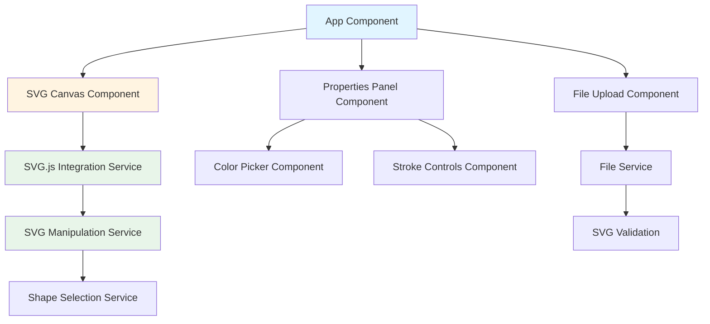

# Angular SVG Editor - Architecture Plan

## Project Overview
An Angular application for basic SVG file editing with the ability to open, preview, and modify SVG shapes. The application will use SVG.js for low-level SVG manipulation and Vitest for testing.

## Technology Stack
- **Framework**: Angular 18+ (latest) with standalone components
- **SVG Manipulation**: SVG.js (@svgdotjs/svg.js)
- **Testing**: Vitest with @analogjs/vitest-angular
- **Styling**: Angular Material (optional) or Tailwind CSS for UI components
- **Build Tool**: Angular CLI with Vite

## Architecture Diagram



## Core Components

### 1. App Component (Root)
- **Type**: Standalone component
- **Responsibility**: Main application layout and component orchestration
- **Features**:
  - Header with app title
  - Layout for upload, canvas, and properties panel
  - State management for active SVG

### 2. File Upload Component
- **Type**: Standalone component
- **Responsibility**: Handle file selection and validation
- **Features**:
  - File input or drag-and-drop zone
  - SVG file validation
  - Emit loaded SVG data to parent

### 3. SVG Canvas Component
- **Type**: Standalone component
- **Responsibility**: Display and interact with SVG
- **Features**:
  - Render SVG content using SVG.js
  - Handle shape selection via clicks
  - Highlight selected shapes
  - Apply modifications from properties panel
  - Pan and zoom capabilities (optional enhancement)

### 4. Properties Panel Component
- **Type**: Standalone component
- **Responsibility**: Display and modify selected shape properties
- **Features**:
  - Show currently selected shape type and ID
  - Fill color picker
  - Stroke enable/disable toggle
  - Stroke color picker
  - Stroke width control
  - Apply button to commit changes

### 5. Color Picker Component
- **Type**: Standalone component (reusable)
- **Responsibility**: Color selection interface
- **Features**:
  - Native color input or custom color picker
  - Display current color value (hex)
  - Emit color changes

## Core Services

### 1. SVG Service
- **Responsibility**: Core SVG file handling
- **Methods**:
  - `loadSVG(file: File): Observable<string>` - Load and parse SVG file
  - `validateSVG(content: string): boolean` - Validate SVG structure
  - `getSVGDocument(): SVGElement` - Get current SVG DOM element

### 2. SVG Manipulation Service
- **Responsibility**: Interface with SVG.js for editing
- **Methods**:
  - `initializeSVG(container: HTMLElement, svgContent: string): void`
  - `getShapeById(id: string): any` - Get SVG.js shape object
  - `updateFillColor(shapeId: string, color: string): void`
  - `addStroke(shapeId: string, color: string, width: number): void`
  - `removeStroke(shapeId: string): void`
  - `updateStrokeColor(shapeId: string, color: string): void`
  - `exportSVG(): string` - Export modified SVG

### 3. Shape Selection Service
- **Responsibility**: Manage selected shape state
- **Features**:
  - Observable for currently selected shape
  - Methods to select/deselect shapes
  - Store shape properties (fill, stroke, etc.)

## Data Models

### ShapeProperties Interface
```typescript
interface ShapeProperties {
  id: string;
  type: string; // circle, rect, path, etc.
  fill?: string;
  stroke?: string;
  strokeWidth?: number;
  opacity?: number;
}
```

### SVGFile Interface
```typescript
interface SVGFile {
  name: string;
  content: string;
  lastModified: Date;
}
```

## Project Structure
```
svg-editor/
├── src/
│   ├── app/
│   │   ├── components/
│   │   │   ├── file-upload/
│   │   │   │   ├── file-upload.component.ts
│   │   │   │   ├── file-upload.component.html
│   │   │   │   ├── file-upload.component.css
│   │   │   │   └── file-upload.component.spec.ts
│   │   │   ├── svg-canvas/
│   │   │   │   ├── svg-canvas.component.ts
│   │   │   │   ├── svg-canvas.component.html
│   │   │   │   ├── svg-canvas.component.css
│   │   │   │   └── svg-canvas.component.spec.ts
│   │   │   ├── properties-panel/
│   │   │   │   ├── properties-panel.component.ts
│   │   │   │   ├── properties-panel.component.html
│   │   │   │   ├── properties-panel.component.css
│   │   │   │   └── properties-panel.component.spec.ts
│   │   │   └── color-picker/
│   │   │       ├── color-picker.component.ts
│   │   │       ├── color-picker.component.html
│   │   │       ├── color-picker.component.css
│   │   │       └── color-picker.component.spec.ts
│   │   ├── services/
│   │   │   ├── svg.service.ts
│   │   │   ├── svg.service.spec.ts
│   │   │   ├── svg-manipulation.service.ts
│   │   │   ├── svg-manipulation.service.spec.ts
│   │   │   ├── shape-selection.service.ts
│   │   │   └── shape-selection.service.spec.ts
│   │   ├── models/
│   │   │   ├── shape-properties.interface.ts
│   │   │   └── svg-file.interface.ts
│   │   ├── app.component.ts
│   │   ├── app.component.html
│   │   ├── app.component.css
│   │   ├── app.component.spec.ts
│   │   └── app.config.ts
│   ├── assets/
│   │   └── sample-svgs/  # Sample SVG files for testing
│   ├── styles.css
│   └── main.ts
├── vitest.config.ts
├── package.json
├── tsconfig.json
├── angular.json
└── README.md
```

## Testing Strategy

### Unit Tests (Vitest)
- **Component Tests**: Test each component in isolation
  - File upload validation
  - Color picker functionality
  - Properties panel state management
  
- **Service Tests**: Test business logic
  - SVG file loading and validation
  - SVG.js manipulation methods
  - Shape selection state management

### Integration Tests
- **End-to-End Workflows**:
  - Load SVG file → Preview → Select shape → Modify properties
  - Verify SVG.js integration works correctly
  - Test color changes are applied to SVG DOM

## Key Features Implementation Details

### Feature 1: Open and Preview SVG Files
**Components**: File Upload Component, SVG Canvas Component, SVG Service

**Flow**:
1. User selects SVG file via file input or drag-drop
2. File Service validates the file type and structure
3. SVG content is read as text
4. SVG Canvas Component receives content and renders using SVG.js
5. SVG.js creates interactive SVG DOM instance

### Feature 2: Select Shapes
**Components**: SVG Canvas Component, Shape Selection Service

**Flow**:
1. User clicks on a shape in the canvas
2. Click event handler identifies the clicked element
3. Shape Selection Service stores selected shape reference
4. Visual highlight is applied to selected shape (e.g., outline or opacity change)
5. Properties Panel is notified of selection

### Feature 3: Modify Shape Properties
**Components**: Properties Panel Component, Color Picker Component, SVG Manipulation Service

**Flow**:
1. Properties Panel displays current shape properties
2. User modifies fill color using color picker
3. User toggles stroke and sets stroke color
4. Changes are applied via SVG Manipulation Service
5. SVG.js updates the shape attributes in real-time
6. Updated SVG can be exported

## Dependencies

### Core Dependencies
```json
{
  "@angular/animations": "^18.x",
  "@angular/common": "^18.x",
  "@angular/compiler": "^18.x",
  "@angular/core": "^18.x",
  "@angular/forms": "^18.x",
  "@angular/platform-browser": "^18.x",
  "@angular/platform-browser-dynamic": "^18.x",
  "@svgdotjs/svg.js": "^3.2.0",
  "rxjs": "^7.8.0",
  "tslib": "^2.6.0",
  "zone.js": "^0.14.0"
}
```

### Development Dependencies
```json
{
  "@angular-devkit/build-angular": "^18.x",
  "@angular/cli": "^18.x",
  "@angular/compiler-cli": "^18.x",
  "@analogjs/vite-plugin-angular": "^1.x",
  "@analogjs/vitest-angular": "^1.x",
  "typescript": "~5.4.0",
  "vitest": "^1.x",
  "@vitest/ui": "^1.x"
}
```

## Configuration Notes

### Vitest Configuration
- Use `@analogjs/vitest-angular` for Angular component testing
- Configure test environment for DOM manipulation
- Setup test utilities for SVG testing
- Mock file uploads for testing

### SVG.js Integration
- Initialize SVG.js after component view initialization
- Use `AfterViewInit` lifecycle hook
- Ensure proper cleanup on component destroy
- Handle SVG namespaces correctly

## User Interface Layout

```
┌─────────────────────────────────────────────────────┐
│  Angular SVG Editor                                 │
├─────────────────────────────────────────────────────┤
│  [Upload SVG File] or Drag & Drop                   │
├──────────────────────────┬──────────────────────────┤
│                          │  Properties Panel        │
│                          │  ──────────────────────  │
│    SVG Canvas            │  Selected: <shape-type>  │
│    (Preview Area)        │                          │
│                          │  Fill Color: [🎨]        │
│    [SVG Content          │                          │
│     renders here]        │  ☑ Enable Stroke         │
│                          │  Stroke Color: [🎨]      │
│                          │  Stroke Width: [2px ▼]   │
│                          │                          │
│                          │  [Apply Changes]         │
│                          │  [Export SVG]            │
└──────────────────────────┴──────────────────────────┘
```

## Future Enhancements (Out of Scope)
- Add more shape manipulation tools (rotate, scale, transform)
- Support for adding new shapes
- Undo/redo functionality
- Save SVG to local storage or download
- Multi-shape selection
- Layer management
- Text editing within SVG
- Filter and effects application

## Development Workflow

### Phase 1: Project Setup
1. Create Angular project with Vite
2. Install dependencies (SVG.js, Vitest, etc.)
3. Configure Vitest for Angular
4. Setup project structure

### Phase 2: Core Features
1. Implement file upload and validation
2. Create SVG canvas with SVG.js integration
3. Implement shape selection
4. Build properties panel with color pickers

### Phase 3: Testing
1. Write unit tests for all services
2. Write component tests
3. Create integration tests for workflows

### Phase 4: Polish
1. Add styling and responsive design
2. Error handling and user feedback
3. Documentation and README
