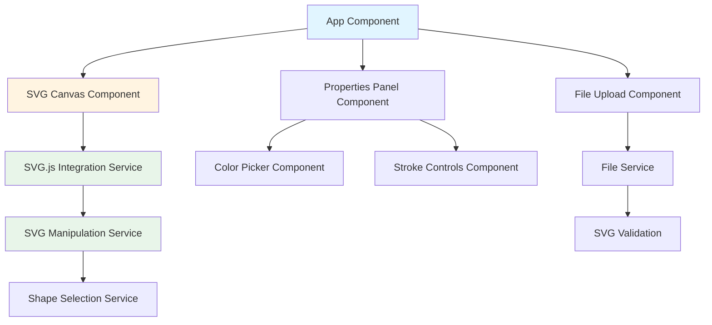

# Angular SVG Editor - Architecture Plan

> **Epics:** [Phase 1 — j61](./epics/hexagonal-architecture-extensibility.md#phase-1--svg-editor-j61-closed) (closed 2026-06-23) · [Phase 2 — hnv](./epics/hexagonal-architecture-extensibility.md#phase-2--svg-editor-hnv-deepen-seams) (closed 2026-06-23) · [Phase 3 — ywh](./epics/hexagonal-architecture-extensibility.md#phase-3--svg-editor-ywh-dedup--unify) (closed 2026-06-23)
> **Vocabulary:** [CONTEXT.md](../CONTEXT.md)

## Current architecture (2026-07)

The editor is a **modular monolith with typed seams**: narrow **ports**, **commands**, and **registries** separate intent from SVG mutation at compile time. Runtime remains Angular singletons — ports are **interface segregation** on shared services, not swappable adapters. Architecture epics: **`svg-editor-j61`** (foundations), **`svg-editor-hnv`** (deepen seams), **`svg-editor-ywh`** (dedup routing + unified tool bundles).

### Modular monolith posture

| Layer | Role |
|-------|------|
| **Ports** | Narrow interfaces in `history/*.port.ts`, `services/shape-content/*.port.ts`, `services/chrome-apply/*.port.ts`, and orchestrator `*-ports.ts` (e.g. `LayerLockReadPort`, `PathBooleanSelectionReadPort`, `GroupStructureChangePort`, `PenToolSessionPorts`) — typed slices of singleton façades |
| **Commands** | `EditorCommand` → `EditorHistoryService`; implementations in `history/commands/{paint,transform,layers,document,path}/` |
| **Façades** | `SvgManipulationService`, `SvgShapeContentService` → `shape-content/*`, `ChromeEditorApplyService` → `chrome-apply/*` (each implements many port interfaces; chrome apply injects port **tokens** backed by `useExisting`) |
| **Registries** | `ToolRegistryService` + `registerDefaultTools()`, `DockPanelRegistryService` + `registerDefaultDockPanels()` |

Large **integration surfaces** remain: `SvgCanvasComponent` remains a large integration hub (tools, session wiring, debug HUD context assembly). Input policy lives in `svg-canvas-click.controller.ts`, `svg-canvas-keyboard-policy.ts`, and `pen-insert-hover-cursor.ts`; preview overlays (`PenPreviewOverlayComponent`, `BooleanPreviewOverlayComponent`) bind via `editorChrome` readouts. Branch features include clip-path commands, outline-to-path, gradient/paint popover, rect corner radius, and SVG ingest sanitization.

### Tool seam (internal refactor)

> **Not an external plugin API.** The tool registry is an **internal refactor seam** for organizing canvas behavior — same modular-monolith posture as ports (DEBT-004). Adding a tool requires **core edits** across closed types and imperative registrar hooks; there is no DI extension token, dynamic manifest, or third-party boundary.

| Piece | Path |
|-------|------|
| Closed tool id union | `EditorTool` — 11 string literals in `editor-tool.service.ts` (`selector`, `node-edit-selector`, `eyedropper`, `zoom`, `pan`, `rect`, `ellipse`, `line`, `text`, `pen`) |
| Tool contract | `src/app/tools/canvas-tool.interface.ts` |
| UI metadata | `src/app/tools/tool-bundles.ts` — `ToolBundle` (descriptor + shortcut + `canvasRegistrationGroup`); re-exported by `register-default-tool-descriptors.ts` |
| Registry | `src/app/tools/tool-registry.service.ts` |
| Startup bootstrap | `register-default-tools.ts` → `registerDefaultToolDescriptors` registers strip/shortcut metadata at app init |
| Deferred adapter binding | `CanvasBoundToolRegistrar` — hard-coded `registerCreationTools` / `registerPenTool` / `registerSelectorTools` / `registerViewUtilityTools` hooks; called from `svg-canvas-pointer-stack.factory.ts` when the pointer stack exists |
| Adapters | `*-canvas-tool.ts` factories (creation, selector + node-edit-selector, pen, zoom, pan, text, eyedropper, …) |
| Orchestrator ports | e.g. `PenToolSessionPorts` + `PenToolSessionSvgPort`, `PathNodeEditSessionPorts`, `InlineTextEditSessionPorts` (narrow slices of the canvas adapter) |
| Adapter context slices | `canvas-adapter-context.ts` + `create-canvas-adapter-context.ts` — shared coordinate, tool-state, document-surface, and readiness types consumed by pen ports and pointer/keyboard seams |
| Coordinate mapping | `CanvasCoordinateMappingService` — bound from canvas lifecycle; `SvgCanvasComponent` delegates via `createCanvasSessionBundle` → `svg-canvas-pointer-stack.factory.ts` |

Descriptors land at **startup**; `CanvasTool` adapters bind **later** when the canvas pointer stack initializes — two-phase registration, not a single plug-in moment.

`CanvasAdapterContext` composes the coordinate, tool-state, and document-surface slices reused across host interfaces; extend it (or individual slices) rather than re-declaring `clientToEditorSvgPoint` / `getCurrentTool` on each seam.

**Future external tools (not implemented):** if third-party or pack-based tools are ever in scope, see the `TOOL_EXTENSION` sketch under [DEBT-005](./ARCHITECTURE-DEBT.md#debt-005--closed-type-plugin-seam-internal-only-) in ARCHITECTURE-DEBT.md.

`PointerGestureRouter` dispatches pointer events to the active `CanvasTool` from the registry. The keyboard controller (`svg-canvas-keyboard.controller.ts`) dispatches `onKeyDown` to the active tool first; pre-registry inline-text Escape, then post-registry canvas-wide policy in `svg-canvas-keyboard-policy.ts` (Escape gesture stack, undo/redo, view shortcuts). Tool-letter shortcuts use `tool-bundles.ts`. Clipboard / align / group / clip-path keyboard commands go through `CanvasEditorCommandController` in the same module. The tool strip renders from `ToolRegistryService.stripGroups()` ([hnv.4](./epics/hexagonal-architecture-extensibility.md)). Dock panels can declare `relevantTools` so the right dock auto-shows for the active tool.

#### Adding a canvas tool (ports/adapters)

Prefer this stack for every new **Tool** — do not grow `SvgCanvasComponent` with tool-specific branches.

1. **Closed union + bundle** — add the tool id literal to `EditorTool` in `editor-tool.service.ts`; add a `ToolBundle` entry in `tool-bundles.ts` (descriptor, `canvasRegistrationGroup`, optional shortcut key). Startup descriptors register via `registerDefaultTools` → `registerDefaultToolDescriptors`.
2. **Orchestrator (optional)** — if the tool has non-trivial session state (like pen), put policy in a dedicated class and inject **narrow ports** (`*HistoryPort`, `*SvgPort`, `*SelectionPort`) defined next to the orchestrator — not the full `SvgManipulationService`.
3. **CanvasTool adapter** — factory in `src/app/tools/<name>-canvas-tool.ts` with a `*CanvasToolDeps` getter; map pointer/keyboard events to the orchestrator; return `true` when the event is consumed.
4. **Canvas adapter wiring** — add or extend a hook on `CanvasBoundToolRegistrar` for the bundle's `canvasRegistrationGroup` (e.g. `registerPenTool`, `registerSelectorTools`, `registerCreationTools`, or `registerViewUtilityTools`); call it from `svg-canvas-pointer-stack.factory.ts` when the pointer stack is ready. Pass only the deps the adapter needs (coordinate mapping, readiness checks, gesture handles).
5. **Mutations** — committed edits go through `EditorCommand` + `EditorHistoryService` (see [`.cursor/rules/editor-commands.mdc`](../.cursor/rules/editor-commands.mdc)); use existing command ports or add a new `*.port.ts` under `history/` or `services/shape-content/`.
6. **Chrome writes** — inspector / dock actions go through `ChromeEditorApplyService` → `chrome-apply/*`, not direct DOM from the tool.

```text
Tool strip / keyboard
       ↓
ToolRegistryService → CanvasTool adapter (*-canvas-tool.ts)
       ↓                      ↓
PointerGestureRouter    optional orchestrator (e.g. PenToolSession)
                               ↓
                         narrow *Ports (history, svg, selection, confirm)
                               ↓
                         EditorCommand / svg.js via port impl (canvas adapter)
```

**Reference implementations:** `pen-canvas-tool.ts` + `PenToolSession` + `pen-tool-session-ports.ts` (orchestrator + ports); `selector-canvas-tool.ts` (gesture delegation via deps); `creation-canvas-tool.ts` (thin adapter over `CreationGesture`).

**Anti-patterns:** importing `SvgCanvasComponent` from a tool; calling `SvgManipulationService` methods that are not on a declared port; adding tool `if` branches in `PointerGestureRouter` when a registered `CanvasTool` can handle the event.

### UI composition

| Piece | Path |
|-------|------|
| Design tokens | `src/styles/tokens.scss` |
| Dock registry | `src/app/panels/dock-panel-registry.service.ts` |
| Dock auto-show | `src/app/panels/dock-panel-auto-show.service.ts` (`relevantTools`) |
| Shell layout | `src/app/services/editor-layout.service.ts` |
| Right dock | `src/app/components/editor-right-dock/` |
| Canvas overlays | `src/app/components/svg-canvas/overlays/` — selection, path-node, pen-preview, boolean-preview, ruler, grid, smart-guide, inline-text-editor |

**Overlay convention:** child components on `<g app-*-overlay>` must use `svg:`-prefixed tags — see [`.cursor/rules/svg-overlay-components.mdc`](../.cursor/rules/svg-overlay-components.mdc).

### Chrome write path

Inspector and layers panel actions go through **`ChromeEditorApplyService`** (thin façade) → **`chrome-apply/{paint,transform,layers,path-ops}`** → `EditorCommand`s. Domain slices inject narrow port **tokens** from `chrome-apply.tokens.ts` (including `CLIP_PATH_SVG_PORT` for clip-path make/release; all backed by `useExisting: SvgManipulationService` in `app.config.ts`).

**Raster insert** (`RasterImageInsertService`) uses the same token pattern via `raster-image-insert.tokens.ts` — `RasterImageInsertSvgPort` (reuses `EditorShapeLifecycleSvgPort` reads + raster insert), history, selection, and tool ports; canvas drag-drop delegates coords + file only.

Group membership changes notify **`GroupStructureChangeService`** (signal port); canvas drill-in listens via `effect()` — no imperative callback on chrome apply.

### Domain slices (gravity wells — split)

| Module | Location | Notes |
|--------|----------|-------|
| Command implementations | `src/app/history/commands/` | paint, transform, layers, document, path |
| Shape content | `src/app/services/shape-content/` | paint, path-data, text ports |
| Chrome apply | `src/app/services/chrome-apply/` | paint, transform, layers, path-ops |
| Layers DnD | `src/app/components/layers-panel/layers-panel-dnd.service.ts` | intent resolution + drop apply |
| Path boolean reads | `path-boolean-selection-read.service.ts` + `history/path-boolean-selection-read.port.ts` | panel + geometry port |

### Editor shell (layout)

```
app.html
├── editor-top-bar
├── editor-tool-context-bar
└── workspace (CSS grid: left rail | canvas column | right dock)
    ├── editor-left-rail (tool strip, file upload, dev assets)
    ├── svg-canvas (+ overlay children, debug strip)
    └── editor-right-dock (registry-driven inspector tabs)
```

State: **signals** (`EditorToolService`, `ShapeSelectionService`, `EditorHistoryService`, `EditorLayoutService`, registries). No NgRx. No routing.

### Still centralized (extension touchpoints)

- **`SvgCanvasComponent`** — inline-text and path-node session wiring, coordinate mapping delegation, keyboard/click context assembly, debug HUD, document init. Preview overlays bind via `editorChrome` readouts (`PenToolChromeReadout`, `PathBooleanChromeReadout`). `CanvasEditorCommandController` centralizes keyboard command dispatch; context menu still splits between `CanvasDocumentActionsService` (clipboard/group/rotate) and command controller (clip-path) plus `ChromeEditorApplyService` (outline-to-path). Orchestrators already exist; new tools should **not** add logic here — extract orchestrators + ports and register a `CanvasTool` adapter instead.
- **`SvgManipulationService`** — wide façade; at new panel/tool boundaries inject a **narrow port** (pattern: `PenToolSessionSvgPort`, `PathBooleanSelectionReadPort`, `SvgShapePaintPort`).

### Architecture debt

Prioritized gaps between documented seams and runtime behavior: **[ARCHITECTURE-DEBT.md](./ARCHITECTURE-DEBT.md)** (adversarial review 2026-07-10). P0 routing debt closed (`svg-editor-my0.1`, `svg-editor-1sb`); hub shrink largely closed (`svg-editor-my0.3` partial — debug HUD + context wiring). Closed: coordinate mapping, preview overlays, boolean chrome readout.

### Next seams (future work)

- Optional: further shrink debug HUD / keyboard context assembly on the canvas adapter (DEBT-003 residual). Clip-path, outline-to-path, and gradient paint features are wired through chrome-apply and canvas context menu.

---

## Original 2024 scaffold (archived)

<details>
<summary>Click to expand — initial project plan (largely superseded)</summary>

## Project Overview
An Angular application for basic SVG file editing with the ability to open, preview, and modify SVG shapes. The application will use SVG.js for low-level SVG manipulation and Vitest for testing.

## Technology Stack
- **Framework**: Angular 18+ (latest) with standalone components
- **SVG Manipulation**: SVG.js (@svgdotjs/svg.js)
- **Testing**: Vitest with @analogjs/vitest-angular
- **Styling**: Angular Material (optional) or Tailwind CSS for UI components
- **Build Tool**: Angular CLI with Vite

## Architecture Diagram



## Core Components

### 1. App Component (Root)
- **Type**: Standalone component
- **Responsibility**: Main application layout and component orchestration
- **Features**:
  - Header with app title
  - Layout for upload, canvas, and properties panel
  - State management for active SVG

### 2. File Upload Component
- **Type**: Standalone component
- **Responsibility**: Handle file selection and validation
- **Features**:
  - File input or drag-and-drop zone
  - SVG file validation
  - Emit loaded SVG data to parent

### 3. SVG Canvas Component
- **Type**: Standalone component
- **Responsibility**: Display and interact with SVG
- **Features**:
  - Render SVG content using SVG.js
  - Handle shape selection via clicks
  - Highlight selected shapes
  - Apply modifications from properties panel
  - Pan and zoom capabilities (optional enhancement)

### 4. Properties Panel Component
- **Type**: Standalone component
- **Responsibility**: Display and modify selected shape properties
- **Features**:
  - Show currently selected shape type and ID
  - Fill color picker
  - Stroke enable/disable toggle
  - Stroke color picker
  - Stroke width control
  - Apply button to commit changes

### 5. Color Picker Component
- **Type**: Standalone component (reusable)
- **Responsibility**: Color selection interface
- **Features**:
  - Native color input or custom color picker
  - Display current color value (hex)
  - Emit color changes

## Core Services

### 1. SVG Service
- **Responsibility**: Core SVG file handling
- **Methods**:
  - `loadSVG(file: File): Observable<string>` - Load and parse SVG file
  - `validateSVG(content: string): boolean` - Validate SVG structure
  - `getSVGDocument(): SVGElement` - Get current SVG DOM element

### 2. SVG Manipulation Service
- **Responsibility**: Interface with SVG.js for editing
- **Methods**:
  - `initializeSVG(container: HTMLElement, svgContent: string): void`
  - `getShapeById(id: string): any` - Get SVG.js shape object
  - `updateFillColor(shapeId: string, color: string): void`
  - `addStroke(shapeId: string, color: string, width: number): void`
  - `removeStroke(shapeId: string): void`
  - `updateStrokeColor(shapeId: string, color: string): void`
  - `exportSVG(): string` - Export modified SVG

### 3. Shape Selection Service
- **Responsibility**: Manage selected shape state
- **Features**:
  - Observable for currently selected shape
  - Methods to select/deselect shapes
  - Store shape properties (fill, stroke, etc.)

## Data Models

### ShapeProperties Interface
```typescript
interface ShapeProperties {
  id: string;
  type: string; // circle, rect, path, etc.
  fill?: string;
  stroke?: string;
  strokeWidth?: number;
  opacity?: number;
}
```

### SVGFile Interface
```typescript
interface SVGFile {
  name: string;
  content: string;
  lastModified: Date;
}
```

## Project Structure
```
svg-editor/
├── src/
│   ├── app/
│   │   ├── components/
│   │   │   ├── file-upload/
│   │   │   │   ├── file-upload.component.ts
│   │   │   │   ├── file-upload.component.html
│   │   │   │   ├── file-upload.component.css
│   │   │   │   └── file-upload.component.spec.ts
│   │   │   ├── svg-canvas/
│   │   │   │   ├── svg-canvas.component.ts
│   │   │   │   ├── svg-canvas.component.html
│   │   │   │   ├── svg-canvas.component.css
│   │   │   │   └── svg-canvas.component.spec.ts
│   │   │   ├── properties-panel/
│   │   │   │   ├── properties-panel.component.ts
│   │   │   │   ├── properties-panel.component.html
│   │   │   │   ├── properties-panel.component.css
│   │   │   │   └── properties-panel.component.spec.ts
│   │   │   └── color-picker/
│   │   │       ├── color-picker.component.ts
│   │   │       ├── color-picker.component.html
│   │   │       ├── color-picker.component.css
│   │   │       └── color-picker.component.spec.ts
│   │   ├── services/
│   │   │   ├── svg.service.ts
│   │   │   ├── svg.service.spec.ts
│   │   │   ├── svg-manipulation.service.ts
│   │   │   ├── svg-manipulation.service.spec.ts
│   │   │   ├── shape-selection.service.ts
│   │   │   └── shape-selection.service.spec.ts
│   │   ├── models/
│   │   │   ├── shape-properties.interface.ts
│   │   │   └── svg-file.interface.ts
│   │   ├── app.component.ts
│   │   ├── app.component.html
│   │   ├── app.component.css
│   │   ├── app.component.spec.ts
│   │   └── app.config.ts
│   ├── assets/
│   │   └── sample-svgs/  # Sample SVG files for testing
│   ├── styles.css
│   └── main.ts
├── vitest.config.ts
├── package.json
├── tsconfig.json
├── angular.json
└── README.md
```

## Testing Strategy

### Unit Tests (Vitest)
- **Component Tests**: Test each component in isolation
  - File upload validation
  - Color picker functionality
  - Properties panel state management
  
- **Service Tests**: Test business logic
  - SVG file loading and validation
  - SVG.js manipulation methods
  - Shape selection state management

### Integration Tests
- **End-to-End Workflows**:
  - Load SVG file → Preview → Select shape → Modify properties
  - Verify SVG.js integration works correctly
  - Test color changes are applied to SVG DOM

## Key Features Implementation Details

### Feature 1: Open and Preview SVG Files
**Components**: File Upload Component, SVG Canvas Component, SVG Service

**Flow**:
1. User selects SVG file via file input or drag-drop
2. File Service validates the file type and structure
3. SVG content is read as text
4. SVG Canvas Component receives content and renders using SVG.js
5. SVG.js creates interactive SVG DOM instance

### Feature 2: Select Shapes
**Components**: SVG Canvas Component, Shape Selection Service

**Flow**:
1. User clicks on a shape in the canvas
2. Click event handler identifies the clicked element
3. Shape Selection Service stores selected shape reference
4. Visual highlight is applied to selected shape (e.g., outline or opacity change)
5. Properties Panel is notified of selection

### Feature 3: Modify Shape Properties
**Components**: Properties Panel Component, Color Picker Component, SVG Manipulation Service

**Flow**:
1. Properties Panel displays current shape properties
2. User modifies fill color using color picker
3. User toggles stroke and sets stroke color
4. Changes are applied via SVG Manipulation Service
5. SVG.js updates the shape attributes in real-time
6. Updated SVG can be exported

## Dependencies

### Core Dependencies
```json
{
  "@angular/animations": "^18.x",
  "@angular/common": "^18.x",
  "@angular/compiler": "^18.x",
  "@angular/core": "^18.x",
  "@angular/forms": "^18.x",
  "@angular/platform-browser": "^18.x",
  "@angular/platform-browser-dynamic": "^18.x",
  "@svgdotjs/svg.js": "^3.2.0",
  "rxjs": "^7.8.0",
  "tslib": "^2.6.0",
  "zone.js": "^0.14.0"
}
```

### Development Dependencies
```json
{
  "@angular-devkit/build-angular": "^18.x",
  "@angular/cli": "^18.x",
  "@angular/compiler-cli": "^18.x",
  "@analogjs/vite-plugin-angular": "^1.x",
  "@analogjs/vitest-angular": "^1.x",
  "typescript": "~5.4.0",
  "vitest": "^1.x",
  "@vitest/ui": "^1.x"
}
```

## Configuration Notes

### Vitest Configuration
- Use `@analogjs/vitest-angular` for Angular component testing
- Configure test environment for DOM manipulation
- Setup test utilities for SVG testing
- Mock file uploads for testing

### SVG.js Integration
- Initialize SVG.js after component view initialization
- Use `AfterViewInit` lifecycle hook
- Ensure proper cleanup on component destroy
- Handle SVG namespaces correctly

## User Interface Layout

```
┌─────────────────────────────────────────────────────┐
│  Angular SVG Editor                                 │
├─────────────────────────────────────────────────────┤
│  [Upload SVG File] or Drag & Drop                   │
├──────────────────────────┬──────────────────────────┤
│                          │  Properties Panel        │
│                          │  ──────────────────────  │
│    SVG Canvas            │  Selected: <shape-type>  │
│    (Preview Area)        │                          │
│                          │  Fill Color: [🎨]        │
│    [SVG Content          │                          │
│     renders here]        │  ☑ Enable Stroke         │
│                          │  Stroke Color: [🎨]      │
│                          │  Stroke Width: [2px ▼]   │
│                          │                          │
│                          │  [Apply Changes]         │
│                          │  [Export SVG]            │
└──────────────────────────┴──────────────────────────┘
```

## Future Enhancements (Out of Scope)
- ~~Add more shape manipulation tools (rotate, scale, transform)~~ — implemented (shape transforms epic)
- ~~Support for adding new shapes~~ — rect/ellipse/line/pen/text
- ~~Undo/redo functionality~~ — `EditorHistoryService` + commands
- ~~Save SVG to local storage or download~~ — export in top bar
- ~~Multi-shape selection~~ — marquee + shift-click
- ~~Layer management~~ — layers panel + group DnD
- ~~Text editing within SVG~~ — inline text edit on canvas
- ~~Wrap remaining tools in `CanvasTool` registry; split `ChromeEditorApplyService`~~ — done in `svg-editor-hnv`
- ~~`EditorLayoutService` for shell layout modes~~ — done (`hnv.8`)
- ~~Extract ruler / grid / smart-guide overlays from canvas~~ — done (`hnv.12`)
- Registry-driven tool strip ([hnv.4](./epics/hexagonal-architecture-extensibility.md))
- Symbols and reusable instances (see [symbols epic](./epics/symbols-reusable-instances.md))

## Development Workflow

### Phase 1: Project Setup
1. Create Angular project with Vite
2. Install dependencies (SVG.js, Vitest, etc.)
3. Configure Vitest for Angular
4. Setup project structure

### Phase 2: Core Features
1. Implement file upload and validation
2. Create SVG canvas with SVG.js integration
3. Implement shape selection
4. Build properties panel with color pickers

### Phase 3: Testing
1. Write unit tests for all services
2. Write component tests
3. Create integration tests for workflows

### Phase 4: Polish
1. Add styling and responsive design
2. Error handling and user feedback
3. Documentation and README

</details>
