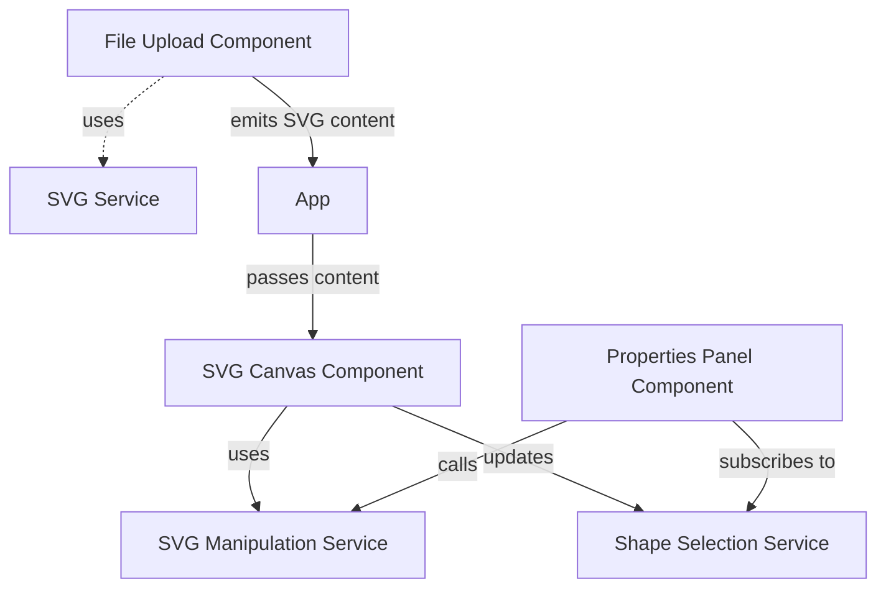

# Project Summary - Angular SVG Editor

## Executive Overview

This document provides a high-level summary of the Angular SVG Editor project, including objectives, architecture decisions, and implementation roadmap.

## Project Goals

### Primary Objectives
1. **Create an intuitive SVG editing tool** using modern Angular practices
2. **Leverage SVG.js** for reliable SVG manipulation
3. **Implement comprehensive testing** using Vitest
4. **Follow Angular best practices** with standalone components and reactive patterns

### User Stories

**As a user, I want to:**
- Upload SVG files from my computer
- Preview SVG files in a canvas
- Select individual shapes within the SVG
- Change the fill color of selected shapes
- Add or remove strokes from shapes
- Customize stroke color and width
- Export my edited SVG files

## Technical Decisions

### Framework Choice: Angular 18+
**Why Angular?**
- Strong TypeScript support
- Excellent tooling and CLI
- Standalone components reduce boilerplate
- Built-in dependency injection
- Robust testing infrastructure

**Why Latest Version?**
- Signals for better reactivity
- Improved performance
- Modern development experience
- Better tree-shaking and bundle sizes

### SVG Manipulation: SVG.js
**Why SVG.js over alternatives?**

| Library | Pros | Cons | Decision |
|---------|------|------|----------|
| **SVG.js** | Lightweight, easy API, good docs | Limited advanced features | ✅ **SELECTED** |
| D3.js | Powerful, data-driven | Heavy, complex for basic editing | ❌ |
| Snap.svg | Adobe-backed, comprehensive | Larger bundle, less maintained | ❌ |
| Fabric.js | Canvas-based, rich features | Not true SVG manipulation | ❌ |

### Testing: Vitest
**Why Vitest over Karma/Jasmine?**
- **Fast**: Powered by Vite, much faster than Karma
- **ESM Support**: Native ES modules support
- **Better DX**: Hot module replacement, parallel execution
- **Modern**: Built for modern JavaScript ecosystem
- **Compatible**: Jest-compatible API, easy migration

### Architecture Pattern: Service-Based

```
Presentation Layer (Components)
        ↓
Business Logic (Services)
        ↓
Data Layer (SVG.js, RxJS)
```

**Benefits:**
- Clear separation of concerns
- Testable business logic
- Reusable services
- Easier maintenance

## Implementation Roadmap

### Milestone 1: Foundation (Week 1)
**Goals:**
- Project setup and configuration
- Development environment ready
- Vitest configured and working

**Deliverables:**
- [ ] Angular project created
- [ ] Dependencies installed
- [ ] Vitest configuration complete
- [ ] Sample test passing

### Milestone 2: Core Services (Week 2)
**Goals:**
- Implement all service layer functionality
- Achieve 90%+ service test coverage

**Deliverables:**
- [ ] SVG Service with file loading
- [ ] Shape Selection Service with RxJS
- [ ] SVG Manipulation Service with SVG.js
- [ ] All services tested

### Milestone 3: Components (Week 3)
**Goals:**
- Build all UI components
- Integrate services with components

**Deliverables:**
- [ ] File Upload Component
- [ ] SVG Canvas Component
- [ ] Properties Panel Component
- [ ] Color Picker Component
- [ ] App Component integration

### Milestone 4: Testing & Polish (Week 4)
**Goals:**
- Complete test coverage
- UI/UX refinement
- Documentation

**Deliverables:**
- [ ] Component tests complete
- [ ] Integration tests complete
- [ ] 80%+ overall coverage
- [ ] Styled and responsive UI
- [ ] User documentation

## Architecture Highlights

### Component Communication



### State Management Strategy

**Service-Based State:**
- `ShapeSelectionService` holds current selection state
- Uses RxJS `BehaviorSubject` for reactive updates
- Components subscribe to state changes
- No need for external state management library (NgRx, Akita, etc.)

**Why This Approach?**
- Simple and sufficient for this scope
- Easier to understand and maintain
- Less boilerplate
- Can scale if needed

### Error Handling Strategy

**Levels of Error Handling:**

1. **Service Level**: Catch and transform errors
2. **Component Level**: Display user-friendly messages
3. **Global Level**: Fallback error boundary (future)

```typescript
// Example error handling pattern
this.svgService.loadSVG(file)
  .pipe(
    catchError(error => {
      this.errorMessage = this.getErrorMessage(error);
      return throwError(() => error);
    })
  )
  .subscribe();
```

## Technical Specifications

### Supported SVG Elements

| Element | Support | Edit Fill | Edit Stroke |
|---------|---------|-----------|-------------|
| `<circle>` | ✅ Yes | ✅ Yes | ✅ Yes |
| `<rect>` | ✅ Yes | ✅ Yes | ✅ Yes |
| `<ellipse>` | ✅ Yes | ✅ Yes | ✅ Yes |
| `<polygon>` | ✅ Yes | ✅ Yes | ✅ Yes |
| `<path>` | ✅ Yes | ✅ Yes | ✅ Yes |
| `<line>` | ✅ Yes | ❌ No | ✅ Yes |
| `<polyline>` | ✅ Yes | ❌ No | ✅ Yes |
| `<text>` | ⚠️ Partial | ✅ Yes | ✅ Yes |
| `<g>` (groups) | 🔮 Future | N/A | N/A |

### File Size Limits

- **Maximum SVG File Size**: 5MB (configurable)
- **Recommended Size**: < 500KB for best performance
- **Maximum Shapes**: 1000+ (tested)

### Performance Targets

| Metric | Target | Rationale |
|--------|--------|-----------|
| Initial Load | < 2s | User perception of speed |
| Shape Selection | < 50ms | Immediate feedback |
| Color Update | < 100ms | Smooth interaction |
| Export SVG | < 500ms | Acceptable wait time |

## Risk Assessment

### Technical Risks

| Risk | Impact | Probability | Mitigation |
|------|--------|-------------|------------|
| SVG.js compatibility issues | High | Low | Thorough testing, fallback options |
| Complex SVG parsing | Medium | Medium | Validation layer, error messages |
| Browser compatibility | Medium | Low | Use standard APIs, test on all browsers |
| Performance with large SVGs | Medium | Medium | Implement lazy loading, optimize rendering |

### Project Risks

| Risk | Impact | Probability | Mitigation |
|------|--------|-------------|------------|
| Scope creep | Medium | High | Strict feature prioritization |
| Timeline delays | Low | Medium | Buffer time in schedule |
| Incomplete testing | High | Low | Test-driven development approach |

## Success Criteria

### Minimum Viable Product (MVP)
- ✅ Can load and preview SVG files
- ✅ Can select shapes
- ✅ Can edit fill colors
- ✅ Can add/remove strokes
- ✅ Can export modified SVGs
- ✅ Has 80%+ test coverage
- ✅ Works in modern browsers

### Nice to Have (Beyond MVP)
- Multiple shape selection
- Undo/redo functionality
- Keyboard shortcuts
- Advanced stroke options (dash patterns)
- Shape transformation tools

## Metrics & KPIs

### Development Metrics
- **Code Coverage**: Target 80%+
- **Build Size**: Target < 500KB (gzipped)
- **Build Time**: Target < 30s
- **Test Execution**: Target < 5s

### Quality Metrics
- **TypeScript Strict Mode**: Enabled
- **Linting**: Zero errors, minimal warnings
- **Accessibility**: WCAG 2.1 Level A (minimum)
- **Browser Support**: Last 2 versions of major browsers

## Dependencies Overview

### Production Dependencies
```json
{
  "@angular/core": "^18.x",
  "@svgdotjs/svg.js": "^3.2.0",
  "rxjs": "^7.8.0",
  "zone.js": "^0.14.0"
}
```

### Development Dependencies
```json
{
  "@angular/cli": "^18.x",
  "typescript": "~5.4.0",
  "vitest": "^1.x",
  "@analogjs/vitest-angular": "^1.x"
}
```

**Total Bundle Impact:**
- Angular Framework: ~150KB (gzipped)
- SVG.js: ~50KB (gzipped)
- Application Code: ~100KB (estimated, gzipped)
- **Total**: ~300KB (gzipped)

## Development Environment

### Required Tools
- Node.js 20+
- npm 10+
- Git
- VS Code (recommended) or any IDE

### Recommended VS Code Extensions
- Angular Language Service
- ESLint
- Prettier
- Vitest Runner
- SVG Viewer

## Deployment Strategy

### Build Process
```bash
ng build --configuration production
```

**Optimizations:**
- Tree-shaking
- Minification
- Compression
- Source maps (optional)

### Hosting Options
- Netlify (recommended for MVP)
- Vercel
- GitHub Pages
- AWS S3 + CloudFront
- Any static hosting service

### Environment Configuration
```typescript
export const environment = {
  production: true,
  maxFileSize: 5 * 1024 * 1024, // 5MB
  allowedFileTypes: ['image/svg+xml'],
  apiEndpoint: null // No backend in MVP
};
```

## Documentation Strategy

### User Documentation
- ✅ README.md with quick start guide
- ✅ Usage examples with screenshots
- ✅ Troubleshooting section
- 📝 Video walkthrough (future)

### Developer Documentation
- ✅ ARCHITECTURE.md - System design
- ✅ IMPLEMENTATION_GUIDE.md - Step-by-step code guide
- ✅ TESTING_STRATEGY.md - Testing approach
- ✅ Inline code comments
- 📝 API documentation (JSDoc)

### Maintenance Documentation
- 📝 Deployment guide
- 📝 Monitoring and logging
- 📝 Performance optimization guide
- 📝 Upgrade path documentation

## Team & Roles

**For this project:**
- Architect: Planning and design
- Developer: Implementation
- Tester: Quality assurance
- (All roles can be fulfilled by same person for learning project)

## Next Steps

### Immediate Actions
1. **Review this plan** with stakeholders/yourself
2. **Set up development environment**
3. **Create Angular project** using Angular CLI
4. **Install dependencies** and configure Vitest
5. **Start with services** (test-driven development)

### Questions to Consider
- Do we need backend integration for saving files?
- Should we add user authentication?
- Do we want to support SVG templates/library?
- Should we implement collaborative editing?

## Conclusion

This project provides a solid foundation for an Angular-based SVG editor. The architecture is scalable, the technology choices are modern and well-supported, and the implementation plan is clear and achievable.

**Key Strengths:**
- Modern Angular with best practices
- Comprehensive testing strategy
- Clear documentation
- Incremental development approach

**Ready to implement!** 🚀

---

*Last Updated: February 7, 2026*
*Architecture Mode: Planning Complete*
