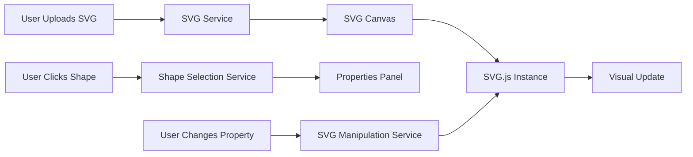

# Angular SVG Editor

A modern Angular application for editing SVG files with a simple and intuitive interface. Built with Angular 18+ standalone components, SVG.js for manipulation, and Vitest for testing.

## Features

### Core Functionality
- ✅ **Open SVG Files**: Upload or drag-and-drop SVG files
- ✅ **Preview SVG**: Real-time SVG rendering in interactive canvas
- ✅ **Select Shapes**: Click on any shape within the SVG to select it
- ✅ **Edit Fill Color**: Change the fill color of selected shapes
- ✅ **Manage Strokes**: Add, remove, and customize stroke properties
- ✅ **Export SVG**: Download modified SVG files

### Technical Highlights
- Built with **Angular 18+** and **standalone components**
- Powered by **SVG.js** for low-level SVG manipulation
- Comprehensive testing with **Vitest** and **@analogjs/vitest-angular**
- Reactive state management with **RxJS**
- Clean, modular architecture

## Quick Start

### Prerequisites
- Node.js 20+ and npm
- Angular CLI (will be installed with dependencies)

### Installation

```bash
# Navigate to project directory
cd ~/Documents/svg-editor

# Create Angular project (if not already created)
ng new svg-editor-app --routing --style=scss --standalone
cd svg-editor-app

# Install dependencies
npm install @svgdotjs/svg.js
npm install -D vitest @vitest/ui @analogjs/vite-plugin-angular @analogjs/vitest-angular jsdom @types/node

# Configure Vitest (see IMPLEMENTATION_GUIDE.md)
```

### Development

```bash
# Start development server
ng serve

# Open browser to http://localhost:4200
```

### Testing

```bash
# Run tests
npm run test

# Run tests with UI
npm run test:ui

# Run tests with coverage
npm run test:coverage
```

### Build

```bash
# Build for production
ng build --configuration production
```

## Project Structure

```
svg-editor-app/
├── src/
│   ├── app/
│   │   ├── components/
│   │   │   ├── file-upload/           # SVG file upload component
│   │   │   ├── svg-canvas/            # SVG preview and interaction
│   │   │   ├── properties-panel/      # Shape property editor
│   │   │   └── color-picker/          # Reusable color picker
│   │   ├── services/
│   │   │   ├── svg.service.ts         # SVG file handling
│   │   │   ├── svg-manipulation.service.ts  # SVG.js integration
│   │   │   └── shape-selection.service.ts   # Selection state
│   │   ├── models/
│   │   │   ├── shape-properties.interface.ts
│   │   │   └── svg-file.interface.ts
│   │   ├── app.component.ts           # Root component
│   │   └── app.config.ts              # App configuration
│   ├── assets/
│   │   └── sample-svgs/               # Sample SVG files
│   └── test-setup.ts                  # Vitest configuration
├── vitest.config.ts
├── package.json
└── README.md
```

## Architecture

### Component Hierarchy

```
App Component
├── File Upload Component
├── SVG Canvas Component
│   └── SVG.js Integration
└── Properties Panel Component
    ├── Color Picker Component (Fill)
    └── Color Picker Component (Stroke)
```

### Service Layer

- **SVG Service**: Handles file I/O and validation
- **SVG Manipulation Service**: Interfaces with SVG.js for editing operations
- **Shape Selection Service**: Manages selected shape state using RxJS

### Data Flow



## Usage

### 1. Load an SVG File
- Click "Choose SVG File" or drag and drop an SVG file into the upload zone
- The SVG will be validated and rendered in the canvas

### 2. Select a Shape
- Click on any shape (circle, rectangle, path, etc.) in the canvas
- The selected shape will be highlighted with a dashed outline
- Shape properties will appear in the properties panel

### 3. Edit Fill Color
- Use the fill color picker to choose a new color
- The shape will update in real-time

### 4. Add/Edit Stroke
- Check "Enable Stroke" to add a stroke to the shape
- Choose stroke color using the stroke color picker
- Adjust stroke width using the number input

### 5. Export Modified SVG
- Click "Export SVG" to download the modified file
- The file will include all your changes

## Key Technologies

### Frontend Framework
- **Angular 18+**: Modern web framework with signals and standalone components
- **TypeScript 5.4**: Type-safe development
- **RxJS 7**: Reactive programming for state management

### SVG Manipulation
- **SVG.js (@svgdotjs/svg.js)**: Lightweight library for SVG manipulation
  - Provides high-level API for SVG operations
  - Supports all SVG elements and attributes
  - Efficient DOM manipulation

### Testing
- **Vitest**: Fast unit test framework powered by Vite
- **@analogjs/vitest-angular**: Angular support for Vitest
- **jsdom**: DOM implementation for testing

## Configuration Files

### vitest.config.ts
Vitest configuration for Angular testing with jsdom environment.

### src/test-setup.ts
Angular testing environment setup with TestBed configuration.

### tsconfig.json
TypeScript compiler configuration.

### angular.json
Angular CLI workspace configuration.

## Development Workflow

### Phase 1: Setup ✓
- Create Angular project
- Install dependencies
- Configure Vitest

### Phase 2: Core Services
- Implement SVG Service for file handling
- Create Shape Selection Service
- Build SVG Manipulation Service with SVG.js

### Phase 3: Components
- File Upload Component with drag-and-drop
- SVG Canvas Component with click handling
- Properties Panel Component
- Color Picker Component

### Phase 4: Testing
- Unit tests for all services (90% coverage goal)
- Component tests (75% coverage goal)
- Integration tests for complete workflows

### Phase 5: Polish
- Styling and responsive design
- Error handling and user feedback
- Documentation

## Testing Strategy

### Unit Tests
- Service logic testing
- Component behavior testing
- Isolated functionality verification

### Integration Tests
- End-to-end workflow testing
- SVG.js integration verification
- State management testing

### Coverage Goals
- Overall: 80%+
- Services: 90%+
- Components: 75%+
- Critical paths: 100%

See [`TESTING_STRATEGY.md`](./TESTING_STRATEGY.md) for detailed testing information.

## API Reference

### SVG Service

```typescript
class SvgService {
  loadSVG(file: File): Observable<string>
  validateSVG(content: string): boolean
  getCurrentSVG(): string
}
```

### SVG Manipulation Service

```typescript
class SvgManipulationService {
  initializeSVG(container: HTMLElement, svgContent: string): void
  updateFillColor(shapeId: string, color: string): void
  addStroke(shapeId: string, color: string, width: number): void
  removeStroke(shapeId: string): void
  updateStrokeColor(shapeId: string, color: string): void
  exportSVG(): string
}
```

### Shape Selection Service

```typescript
class ShapeSelectionService {
  selectedShape$: Observable<ShapeProperties | null>
  selectShape(shape: ShapeProperties): void
  clearSelection(): void
  updateSelectedShape(updates: Partial<ShapeProperties>): void
}
```

## Interfaces

### ShapeProperties
```typescript
interface ShapeProperties {
  id: string;
  type: string;
  fill?: string;
  stroke?: string;
  strokeWidth?: number;
  opacity?: number;
}
```

## Browser Support

- Chrome/Edge: Latest 2 versions
- Firefox: Latest 2 versions
- Safari: Latest 2 versions

## Performance Considerations

- Lazy loading of SVG.js
- Efficient DOM manipulation
- Debounced color updates
- Virtual scrolling for large SVG files (future enhancement)

## Known Limitations

- Currently supports basic SVG shapes (circle, rect, path, polygon, etc.)
- No support for SVG filters or gradients (yet)
- Single shape selection only (multi-select planned for future)
- No undo/redo functionality (planned for future)

## Future Enhancements

### Phase 2 Features
- [ ] Undo/Redo functionality
- [ ] Multi-shape selection
- [ ] Shape transformation (rotate, scale, skew)
- [ ] Layer management
- [ ] Copy/paste shapes

### Phase 3 Features
- [ ] Add new shapes to SVG
- [ ] Text editing
- [ ] Gradient and pattern editors
- [ ] SVG filter effects
- [ ] Keyboard shortcuts

### Phase 4 Features
- [ ] Collaborative editing
- [ ] Cloud storage integration
- [ ] SVG optimization tools
- [ ] Export to PNG/JPG
- [ ] SVG animation timeline

## Troubleshooting

### SVG Not Rendering
- Ensure the SVG file is valid XML
- Check browser console for errors
- Verify SVG.js is properly installed

### Shape Selection Not Working
- Ensure shapes have unique IDs
- Check that click events are not being prevented
- Verify SVG.js initialization

### Tests Failing
- Run `npm install` to ensure all dependencies are installed
- Check Vitest configuration in `vitest.config.ts`
- Verify test setup in `src/test-setup.ts`

## Contributing

This is a learning project. Contributions and suggestions are welcome!

### Development Setup
1. Fork the repository
2. Create a feature branch
3. Make your changes
4. Add tests for new functionality
5. Ensure all tests pass
6. Submit a pull request

## Resources

### Documentation
- [Angular Documentation](https://angular.dev)
- [SVG.js Documentation](https://svgjs.dev/)
- [Vitest Documentation](https://vitest.dev/)

### Tutorials
- [Angular Signals Guide](https://angular.dev/guide/signals)
- [SVG Specification](https://www.w3.org/TR/SVG2/)
- [Testing Angular Applications](https://angular.dev/guide/testing)

## License

MIT License - Feel free to use this project for learning and development.

## Contact

For questions or suggestions, please open an issue in the repository.

---

**Built with ❤️ using Angular and SVG.js**
