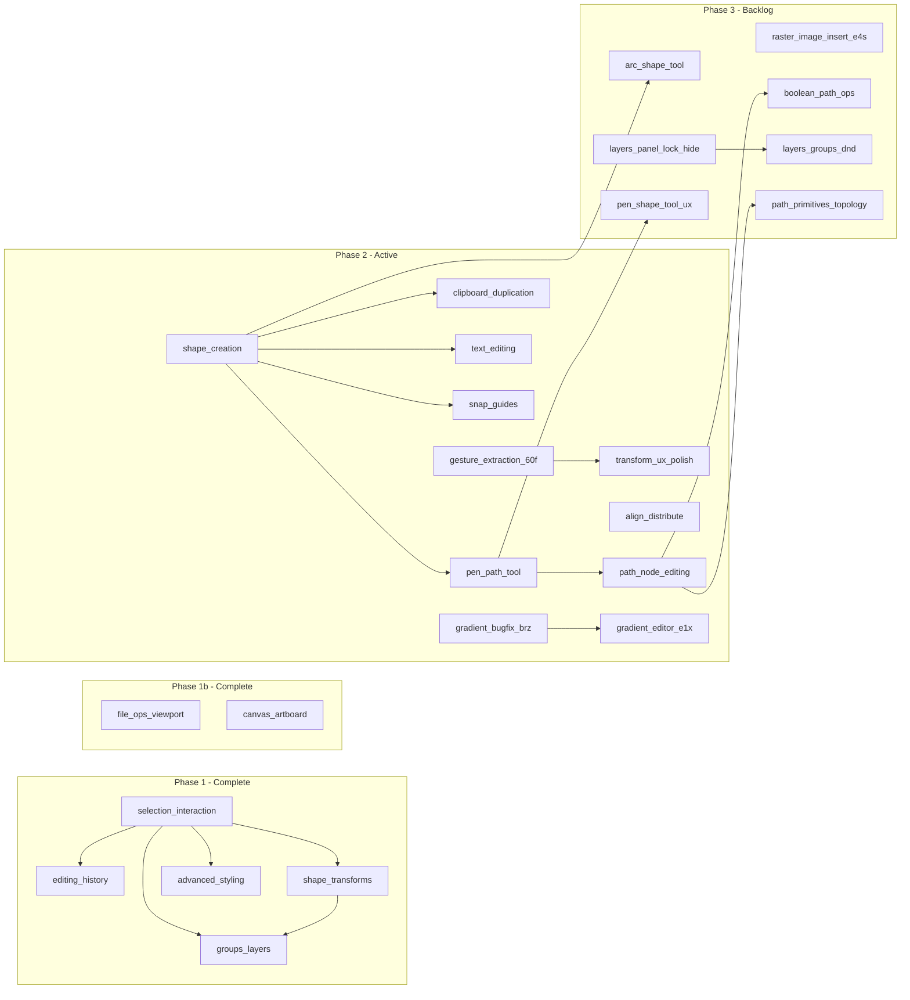

# Product roadmap

Single source of truth for **epic order**, **dependencies**, and **links** to bd-mapped epic plans. Original MVP capabilities (load, preview, select, fill/stroke, export) are documented in [PROJECT_SUMMARY.md](./PROJECT_SUMMARY.md).

## Completed epics (phase 1)

| Order | Epic | Slug | bd status | Progress |
|------:|------|------|-----------|----------|
| 1 | Multi-select and keyboard shortcuts | [selection-interaction](./epics/selection-interaction.md) | `CLOSED` | 8/8 (100%) |
| 2 | Undo and redo | [editing-history](./epics/editing-history.md) | `CLOSED` | 5/5 (100%) |
| 3 | Shape transforms (rotate, scale, skew) | [shape-transforms](./epics/shape-transforms.md) | `CLOSED` | 5/5 (100%) |
| 4 | Groups and layer management | [groups-layers](./epics/groups-layers.md) | `CLOSED` | 5/5 (100%) |
| 5 | Advanced stroke and fill | [advanced-styling](./epics/advanced-styling.md) | `CLOSED` | 5/5 (100%) |
| 9 | File operations and viewport UX | [file-ops-viewport](./epics/file-ops-viewport.md) | `CLOSED` | 5/5 (100%) |
| 7 | Shape creation tools | [shape-creation](./epics/shape-creation.md) | `CLOSED` | 6/6 (100%) |
| 14 | Canvas and artboard | [canvas-artboard](./epics/canvas-artboard.md) | `CLOSED` | 7/7 (100%) |

## Active epics (phase 2)

| Order | Epic | Slug | bd status | Progress | Depends on |
|------:|------|------|-----------|----------|------------|
| 6 | Transform and gesture UX polish | [transform-ux-polish](./epics/transform-ux-polish.md) | `CLOSED` | 8/8 (100%) | Completed in bd (`svg-editor-vfr` auto-closed after `svg-editor-9aq`, `svg-editor-wpd`, `svg-editor-yse`, and `svg-editor-eh1`) |
| 8 | Clipboard and duplication | [clipboard-duplication](./epics/clipboard-duplication.md) | `CLOSED` | 5/5 (100%) | Shape creation helpful but not required |
| 10 | Text editing | [text-editing](./epics/text-editing.md) | `CLOSED` | 5/5 (100%) | Shape creation (SC-1, SC-2a, SC-5) |
| 11 | Align and distribute | [align-distribute](./epics/align-distribute.md) | `CLOSED` | 5/5 (100%) | Multi-select (done) |
| 12 | Snap and guides | [snap-guides](./epics/snap-guides.md) | `CLOSED` | 9/9 (100%) | Shape creation (epic 7) helpful |
| 13 | Pen and path tool | [pen-path-tool](./epics/pen-path-tool.md) | `CLOSED` | 7/7 (100%) | Shape creation (SC-1, shares tool infra); follow-on beads `tfs.8`+ also **closed** in `bd` |
| 15 | Path node editing | [path-node-editing](./epics/path-node-editing.md) | `CLOSED` | 5/5 (100%) | Pen tool (PP-2a segment model) |
| 16 | Advanced path editing | [advanced-path-editing](./epics/advanced-path-editing.md) | `CLOSED` | 10/10 (100%) | Path node editing (`svg-editor-cfc`), pen/path foundation (`svg-editor-tfs`) |

## Completed epics (phase 3)

| Order | Epic | Slug | bd epic ID | Status | Notes |
|------:|------|------|-------------|--------|-------|
| 17 | Tool parity and pen authoring | [tool-parity-pen](./epics/tool-parity-pen.md) | `svg-editor-j24` | `CLOSED` | **Closed in `bd` 2026-05-25** — in-scope 12/12; booleans → epic `svg-editor-0zh`, symbols → epic `svg-editor-hya`, arc → [arc-shape-tool](./epics/arc-shape-tool.md). |
| 18 | Always-visible paint defaults | [always-visible-paint-defaults](./epics/always-visible-paint-defaults.md) | `svg-editor-6g0` | `CLOSED` | **Closed in `bd`** — 5/5 children (`6g0.1`–`6g0.4`, `9i5`). |
| 20 | Text editing refinement | [text-editing-refinement](./epics/text-editing-refinement.md) | `svg-editor-79x` | `CLOSED` | **Closed in `bd` 2026-05-22** — 4/4 children (`79x.1`–`79x.4`). |
| 23 | Layer panel — lock, hide, reorder | [layers-panel-lock-hide-reorder](./epics/layers-panel-lock-hide-reorder.md) | `svg-editor-m2k` | `CLOSED` | **Closed in `bd` 2026-05-25** — lock + DnD + guards; children `m2k.1`–`m2k.7` |

## Active epics (phase 3)

| Order | Epic | Slug | bd epic ID | Status | Notes |
|------:|------|------|-------------|--------|-------|
| 19 | Insert raster images into SVG | [raster-image-insert](./epics/raster-image-insert.md) | `svg-editor-e4s` | `OPEN` | Spec → insert API → command → toolbar + drop → parity + export + tests (`e4s.1`–`e4s.8`) |
| 21 | Boolean path operations | [boolean-path-operations](./epics/boolean-path-operations.md) | `svg-editor-0zh` | `OPEN` | Union / subtract / intersect; **dedicated boolean panel**; epic bead (`type=epic`) |
| 22 | Elliptical arc shape tool | [arc-shape-tool](./epics/arc-shape-tool.md) | `TBD` | `OPEN` | **Arc tool** next to rect/circle (not pen-only); bead `svg-editor-j24.7`; spike [`pen-elliptical-arc-authoring`](./spikes/pen-elliptical-arc-authoring.md); exit `svg-editor-bmy` when superseded |
| 24 | Layer–group drag-and-drop | [layers-groups-dnd](./epics/layers-groups-dnd.md) | `TBD` | `PLANNED` | Reparent rows in/out of **Group**s, intra-group order; depends on epic 23 panel DnD |
| 25 | Path primitives and node topology | [path-primitives-and-node-topology](./epics/path-primitives-and-node-topology.md) | `TBD` | `PLANNED` | **Outline to path**, add/remove **Path node**s, **Corner node** ↔ **Smooth node** |
| 26 | Pen and shape tool interaction UX | [pen-shape-tool-ux](./epics/pen-shape-tool-ux.md) | `TBD` | `PLANNED` | Pen clicks place nodes over existing shapes; auto-switch to select after shape draw |
| 27 | Gradient paint popover and stroke gradients | [gradient-paint-popover](./epics/gradient-paint-popover.md) | `svg-editor-qpk` | `OPEN` | Unified paint swatch popover; stroke gradient parity; gradient removal + def GC; follow-on `qpk.6` visual editor |

## Infrastructure epics (architecture)

| Phase | Epic | Slug | bd epic ID | Status | Notes |
|------:|------|------|------------|--------|-------|
| 1 | Hexagonal architecture — foundations | [hexagonal-architecture-extensibility](./epics/hexagonal-architecture-extensibility.md) | `svg-editor-j61` | `CLOSED` | Tool registry, dock registry, overlays |
| 2 | Hexagonal architecture — deepen seams | [hexagonal-architecture-extensibility](./epics/hexagonal-architecture-extensibility.md#phase-2--svg-editor-hnv-deepen-seams) | `svg-editor-hnv` | `CLOSED` | Command/chrome splits, `CanvasTool` adapters, layout service |
| 3 | Canvas adapter dedup + unified tool registry | [hexagonal-architecture-extensibility](./epics/hexagonal-architecture-extensibility.md#phase-3--svg-editor-ywh-dedup--unify) | `svg-editor-ywh` | `CLOSED` | Legacy router removed; `tool-bundles.ts`; `canvas-adapter-context.ts` (7/7) |

## Free-standing issues

All items below are **closed in `bd`** (audit trail); there are **no open** roadmap freestanding beads as of 2026-05-25.

| bd ID | Title | Priority | Notes |
|-------|-------|----------|-------|
| `svg-editor-60f` | Extract gesture handlers from svg-canvas | P2 | DONE (refactoring prerequisite for epic 6) |
| `svg-editor-ag5` | Undo delete should restore selection | P2 | DONE (small UX fix) |
| `svg-editor-brz` | Bug: normalizeColorForPicker destroys gradient fills | P2 | DONE (bug fix) |
| `svg-editor-e1x` | Full gradient editor UI | P3 | **DONE** — plan [gradient-editor](./epics/gradient-editor.md) |
| `svg-editor-cno` | Bug: dragging Tree group hides child layer elements after drop | P2 | **DONE** — closed in `bd` 2026-05-07 |
| `svg-editor-0lx` | Investigate group/ungroup behavior with pre-existing groups | P2 | **DONE** — closed in `bd` 2026-04-30 (tests + group/ungroup behavior) |
| `svg-editor-5el` | Bug: artboard boundary stroke scales with zoom despite vector-effect | P2 | **DONE** — closed in `bd` 2026-05-07; artboard outline → CSS-zoom-independent overlay (see bead close reason) |
| `svg-editor-j1a` | Enhancement: artboard resize anchor point selector (9-point) | P3 | **DONE** — document settings 9-point grid; `setArtboardSize` + `ArtboardSizeCommand` undo (`document-settings`, `artboard.model`, specs) |

## Boolean path operations (new epic)

Plan: [boolean-path-operations](./epics/boolean-path-operations.md). Epic bead: `svg-editor-0zh` (`bd show svg-editor-0zh`).

## Gradient paint popover (new epic)

Plan: [gradient-paint-popover](./epics/gradient-paint-popover.md). Epic bead: `svg-editor-qpk` (`bd show svg-editor-qpk`).

Children: `svg-editor-qpk.1` (popover component) · `qpk.2` (chrome apply) · `qpk.3` (stroke editor) · `qpk.4` (panel wiring) · `qpk.5` (tests) · `qpk.6` (visual on-canvas editor — future).

## Elliptical arc shape tool (new epic)

Plan: [arc-shape-tool](./epics/arc-shape-tool.md). Primary bead: `svg-editor-j24.7` (reparent from `svg-editor-bmy` to new epic; product = **Arc tool** alongside rect/circle).

## Text editing refinement (epic `svg-editor-79x`)

Epic **`CLOSED` in `bd` (2026-05-22)** — children were:

| Theme | bd IDs |
|--------|--------|
| Live preview (place + edit) | `svg-editor-79x.1`, `svg-editor-79x.2` |
| Text outline / stroke semantics | `svg-editor-79x.3` |
| Tests and polish | `svg-editor-79x.4` (depends on `.1`–`.3`) |

## Insert raster images (epic `svg-editor-e4s`)

All items below are **children of epic** [`svg-editor-e4s`](./epics/raster-image-insert.md) (`bd show svg-editor-e4s`).

| Theme | bd IDs |
|--------|--------|
| Spec + export policy | `svg-editor-e4s.1`, `svg-editor-e4s.7` |
| Insert + history | `svg-editor-e4s.2`, `svg-editor-e4s.3` |
| UX entry points | `svg-editor-e4s.4`, `svg-editor-e4s.5` |
| Parity + QA | `svg-editor-e4s.6`, `svg-editor-e4s.8` |

## Always-visible paint defaults (epic `svg-editor-6g0`)

Epic **`CLOSED` in `bd`** — children were:

| Theme | bd IDs |
|--------|--------|
| Defaults/state foundation | `svg-editor-6g0.1`, `svg-editor-6g0.2` |
| Properties panel UI | `svg-editor-9i5` |
| Creation + coverage | `svg-editor-6g0.3`, `svg-editor-6g0.4` |

## Post-MVP

| bd ID | Title | Priority | Notes |
|-------|-------|----------|-------|
| — | Raster export (PNG/JPEG) | P4 | Export canvas as PNG with resolution/scale selector |
| — | Preview mode (artboard clipping) | P4 | Clip/dim content outside artboard boundary |
| — | Configurable keyboard shortcuts | P4 | User-editable shortcut bindings |
| — | Align to artboard/canvas | P4 | Align shapes relative to document bounds (vs. selection bounds) |
| — | Symbols and reusable instances | P4 | Epic **`svg-editor-hya`** — plan [symbols-reusable-instances](./epics/symbols-reusable-instances.md) (post-MVP) |
| — | Animation authoring GUI | P4 | **Massive epic:** timeline/keyframe-style UI for authoring animations; **phase 1 — CSS** (e.g. `@keyframes`, transitions on SVG/CSS properties); **phase 2 — optional** JavaScript-driven or scriptable motion if product needs it; expect many bd children when scoped |

## Dependency graph

## Recommended execution order

1. ~~**Now (free-standing):** `svg-editor-brz` (bug), `svg-editor-ag5` (UX fix), `svg-editor-60f` (refactoring)~~ -- **DONE**
2. ~~**Epic 7** (shape creation)~~ -- **DONE**
3. ~~**Epic 13** (pen / path tool)~~ -- **DONE**
4. ~~**Epic 8** (clipboard / duplication)~~ -- **DONE**
5. ~~**Epic 11** (align / distribute)~~ -- **DONE**
6. ~~**Epic 12** (snap / guides)~~ -- **DONE**
7. ~~**Epic 6** (transform UX polish)~~ -- **DONE**
8. ~~**Epic 10** (text editing)~~ -- **DONE**
9. ~~**Epic 16** (advanced path editing)~~ -- **DONE**
10. ~~**`svg-editor-e1x`** (gradient editor)~~ -- **DONE**
11. ~~**Epic 17 ([tool-parity-pen](./epics/tool-parity-pen.md), `svg-editor-j24`):** transform + pen parity~~ — **CLOSED in `bd` 2026-05-25**; booleans → epic `svg-editor-0zh`, symbols → epic `svg-editor-hya`, arc → [arc-shape-tool](./epics/arc-shape-tool.md).
12. **Epic 21 ([boolean-path-operations](./epics/boolean-path-operations.md)):** path booleans; **dedicated panel**; bead `svg-editor-0zh`.
13. **Epic 22 ([arc-shape-tool](./epics/arc-shape-tool.md)):** **Arc creation tool** (toolbar with rect/circle); bead `svg-editor-j24.7`; consolidate/close `svg-editor-bmy` when done.
14. ~~**Epic 18 ([always-visible-paint-defaults](./epics/always-visible-paint-defaults.md), `svg-editor-6g0`):** always-visible paint + defaults~~ — **CLOSED in `bd`** (5/5).
15. ~~**Epic 20 ([text-editing-refinement](./epics/text-editing-refinement.md), `svg-editor-79x`):** live preview + text outline + tests~~ — **CLOSED in `bd` 2026-05-22** (4/4).
16. **Post-MVP — [symbols-reusable-instances](./epics/symbols-reusable-instances.md):** epic `svg-editor-hya`; document-level symbols / `<use>`.
17. ~~**Epic 23 ([layers-panel-lock-hide-reorder](./epics/layers-panel-lock-hide-reorder.md), `svg-editor-m2k`):** **Layer visibility**, **Layer lock**, drag reorder in layers panel~~ — **CLOSED in `bd` 2026-05-25** (`m2k.1`–`m2k.7`).
18. **Epic 24 ([layers-groups-dnd](./epics/layers-groups-dnd.md)):** panel DnD reparent in/out of **Group**s and reorder within groups — after epic 23 reorder exists.
19. **Epic 25 ([path-primitives-and-node-topology](./epics/path-primitives-and-node-topology.md)):** convert rect/circle/line to path; path node add/remove; corner ↔ smooth nodes — extends closed path epics.
20. **Epic 26 ([pen-shape-tool-ux](./epics/pen-shape-tool-ux.md)):** pen **Tool** places nodes when clicking existing shapes; auto-return to select **Tool** after shape creation.

## Beads epic references

Epic issues in `bd` (see `bd list -t epic` or `bd show <id>` if this table drifts).
Status synced from **`bd show`** on **2026-05-25**; re-run if drift.

| Slug | bd epic ID | Title | Status | Progress |
|------|------------|--------|--------|----------|
| raster-image-insert | `svg-editor-e4s` | Insert raster images into SVG | `OPEN` | 1/9 (see `bd show svg-editor-e4s`) |
| boolean-path-operations | `svg-editor-0zh` | Boolean path operations | `OPEN` | epic umbrella |
| arc-shape-tool | `TBD` | Elliptical arc shape tool | `OPEN` | migrate `svg-editor-j24.7` |
| layers-panel-lock-hide-reorder | `svg-editor-m2k` | Layer panel — lock, hide, reorder | `CLOSED` | children closed `m2k.1`–`m2k.7` |
| layers-groups-dnd | `TBD` | Layer–group drag-and-drop | `PLANNED` | depends on layers-panel epic |
| path-primitives-and-node-topology | `TBD` | Path primitives and node topology | `PLANNED` | outline + node CRUD + corner/smooth |
| pen-shape-tool-ux | `TBD` | Pen and shape tool interaction UX | `PLANNED` | pen-over-shapes + post-create select |
| symbols-reusable-instances | `svg-editor-hya` | Symbols and reusable instances | `BACKLOG` | post-MVP epic |
| always-visible-paint-defaults | `svg-editor-6g0` | Always-visible paint defaults | `CLOSED` | 5/5 |
| text-editing-refinement | `svg-editor-79x` | Text editing refinement | `CLOSED` | 4/4 |
| tool-parity-pen | `svg-editor-j24` | Tool parity and pen authoring | `CLOSED` | 12/12 |
| selection-interaction | `svg-editor-3b7` | Multi-select and keyboard shortcuts | `CLOSED` | 8/8 |
| editing-history | `svg-editor-bbc` | Undo and redo | `CLOSED` | 5/5 |
| shape-transforms | `svg-editor-2zo` | Shape transforms | `CLOSED` | 5/5 |
| groups-layers | `svg-editor-0l4` | Groups and layer management | `CLOSED` | 5/5 |
| advanced-styling | `svg-editor-v77` | Advanced stroke and fill | `CLOSED` | 5/5 |
| transform-ux-polish | `svg-editor-vfr` | Transform and gesture UX polish | `CLOSED` | 8/8 |
| shape-creation | `svg-editor-og7` | Shape creation tools | `CLOSED` | 6/6 |
| clipboard-duplication | `svg-editor-d79` | Clipboard and duplication | `CLOSED` | 5/5 |
| file-ops-viewport | `svg-editor-we7` | File operations and viewport UX | `CLOSED` | 5/5 |
| text-editing | `svg-editor-nkz` | Text editing | `CLOSED` | 5/5 |
| align-distribute | `svg-editor-lzc` | Align and distribute | `CLOSED` | 5/5 |
| snap-guides | `svg-editor-l6c` | Snap and guides | `CLOSED` | 9/9 |
| pen-path-tool | `svg-editor-tfs` | Pen and path tool | `CLOSED` | 7/7 |
| canvas-artboard | `svg-editor-dl9` | Canvas and artboard | `CLOSED` | 7/7 |
| path-node-editing | `svg-editor-cfc` | Path node editing | `CLOSED` | 5/5 |
| advanced-path-editing | `svg-editor-4nz` | Advanced path editing | `CLOSED` | 10/10 |

## How to use this roadmap

1. Approve or adjust epic order and dependencies above.
2. Open the linked epic plan under `plans/epics/` for implementation detail and **`bd create` mappings**.
3. Track work with `bd ready`, `bd show <id>`, `bd update <id> --claim`, `bd epic status`, and parent/child links as described in [AGENTS.md](../AGENTS.md).
