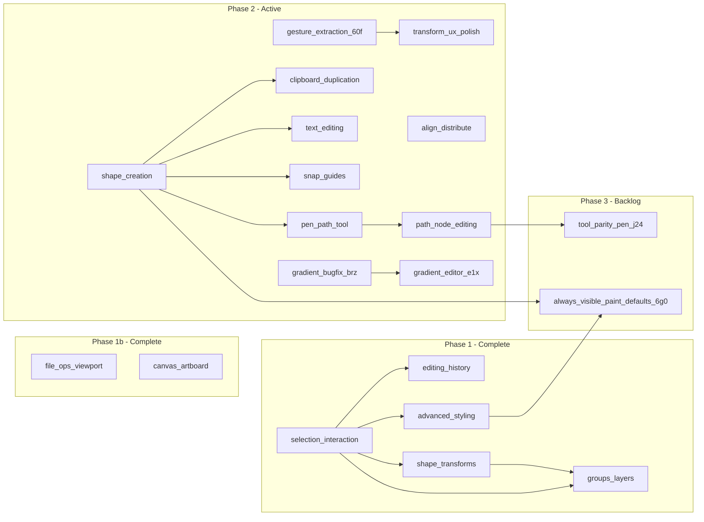

# Product roadmap

Single source of truth for **epic order**, **dependencies**, and **links** to bd-mapped epic plans. Original MVP capabilities (load, preview, select, fill/stroke, export) are documented in [PROJECT_SUMMARY.md](./PROJECT_SUMMARY.md).

## Completed epics (phase 1)

| Order | Epic | Slug | bd status | Progress |
|------:|------|------|-----------|----------|
| 1 | Multi-select and keyboard shortcuts | [selection-interaction](./epics/selection-interaction.md) | `CLOSED` | 8/8 (100%) |
| 2 | Undo and redo | [editing-history](./epics/editing-history.md) | `CLOSED` | 5/5 (100%) |
| 3 | Shape transforms (rotate, scale, skew) | [shape-transforms](./epics/shape-transforms.md) | `CLOSED` | 5/5 (100%) |
| 4 | Groups and layer management | [groups-layers](./epics/groups-layers.md) | `CLOSED` | 5/5 (100%) |
| 5 | Advanced stroke and fill | [advanced-styling](./epics/advanced-styling.md) | `CLOSED` | 5/5 (100%) |
| 9 | File operations and viewport UX | [file-ops-viewport](./epics/file-ops-viewport.md) | `CLOSED` | 5/5 (100%) |
| 7 | Shape creation tools | [shape-creation](./epics/shape-creation.md) | `CLOSED` | 6/6 (100%) |
| 14 | Canvas and artboard | [canvas-artboard](./epics/canvas-artboard.md) | `CLOSED` | 7/7 (100%) |

## Active epics (phase 2)

| Order | Epic | Slug | bd status | Progress | Depends on |
|------:|------|------|-----------|----------|------------|
| 6 | Transform and gesture UX polish | [transform-ux-polish](./epics/transform-ux-polish.md) | `CLOSED` | 8/8 (100%) | Completed in bd (`svg-editor-vfr` auto-closed after `svg-editor-9aq`, `svg-editor-wpd`, `svg-editor-yse`, and `svg-editor-eh1`) |
| 8 | Clipboard and duplication | [clipboard-duplication](./epics/clipboard-duplication.md) | `CLOSED` | 5/5 (100%) | Shape creation helpful but not required |
| 10 | Text editing | [text-editing](./epics/text-editing.md) | `CLOSED` | 5/5 (100%) | Shape creation (SC-1, SC-2a, SC-5) |
| 11 | Align and distribute | [align-distribute](./epics/align-distribute.md) | `CLOSED` | 5/5 (100%) | Multi-select (done) |
| 12 | Snap and guides | [snap-guides](./epics/snap-guides.md) | `CLOSED` | 9/9 (100%) | Shape creation (epic 7) helpful |
| 13 | Pen and path tool | [pen-path-tool](./epics/pen-path-tool.md) | `CLOSED` | 7/7 (100%) | Shape creation (SC-1, shares tool infra); optional beads tfs.8–11 open in bd |
| 15 | Path node editing | [path-node-editing](./epics/path-node-editing.md) | `CLOSED` | 5/5 (100%) | Pen tool (PP-2a segment model) |
| 16 | Advanced path editing | [advanced-path-editing](./epics/advanced-path-editing.md) | `CLOSED` | 10/10 (100%) | Path node editing (`svg-editor-cfc`), pen/path foundation (`svg-editor-tfs`) |

## Active epics (phase 3)

| Order | Epic | Slug | bd epic ID | Status | Notes |
|------:|------|------|-------------|--------|-------|
| 17 | Tool parity and pen authoring | [tool-parity-pen](./epics/tool-parity-pen.md) | `svg-editor-j24` | `OPEN` | Transform/readout gaps + pen parity (`j24.1`–`j24.7`, arc phased after Q/S/T); does not reopen closed epics |
| 18 | Always-visible paint defaults | [always-visible-paint-defaults](./epics/always-visible-paint-defaults.md) | `svg-editor-6g0` | `OPEN` | Single contextual paint controls + drawing defaults across creation flows |
| 19 | Insert raster images into SVG | [raster-image-insert](./epics/raster-image-insert.md) | `svg-editor-e4s` | `OPEN` | Spec → insert API → command → toolbar + drop → parity + export + tests (`e4s.1`–`e4s.8`) |

## Free-standing issues

These beads are not part of an epic and can be tackled independently.

| bd ID | Title | Priority | Notes |
|-------|-------|----------|-------|
| `svg-editor-60f` | Extract gesture handlers from svg-canvas | P2 | DONE (refactoring prerequisite for epic 6) |
| `svg-editor-ag5` | Undo delete should restore selection | P2 | DONE (small UX fix) |
| `svg-editor-brz` | Bug: normalizeColorForPicker destroys gradient fills | P2 | DONE (bug fix) |
| `svg-editor-e1x` | Full gradient editor UI | P3 | **DONE** — plan [gradient-editor](./epics/gradient-editor.md) |
| `svg-editor-cno` | Bug: dragging Tree group hides child layer elements after drop | P2 | Drag/drop visibility bug with nested groups |
| `svg-editor-0lx` | Investigate group/ungroup behavior with pre-existing groups | P2 | Edge-case exploration for nested group operations |
| `svg-editor-5el` | Bug: artboard boundary stroke scales with zoom despite vector-effect | P2 | `vector-effect: non-scaling-stroke` ineffective under `preserveAspectRatio="none"` |
| `svg-editor-j1a` | Enhancement: artboard resize anchor point selector (9-point) | P3 | Choose which corner/edge/center stays fixed when resizing |

## Tool parity and pen authoring (epic `svg-editor-j24`)

All items below are **children of epic** [`svg-editor-j24`](./epics/tool-parity-pen.md) (`bd show svg-editor-j24`). See the epic plan for local refs **TP-1…TP-6** (transform/UI) and **PPEN-1…PPEN-7** (pen).

| Theme | bd IDs |
|--------|--------|
| Transform / readouts | `svg-editor-e9a`, `svg-editor-jqe`, `svg-editor-zc7`, `svg-editor-269`, `svg-editor-0zh`, `svg-editor-hya` |
| Pen authoring parity | `svg-editor-j24.1` … `svg-editor-j24.7` (phase: Q/S/T in `j24.2`, then `A` in `j24.7`) |

## Insert raster images (epic `svg-editor-e4s`)

All items below are **children of epic** [`svg-editor-e4s`](./epics/raster-image-insert.md) (`bd show svg-editor-e4s`).

| Theme | bd IDs |
|--------|--------|
| Spec + export policy | `svg-editor-e4s.1`, `svg-editor-e4s.7` |
| Insert + history | `svg-editor-e4s.2`, `svg-editor-e4s.3` |
| UX entry points | `svg-editor-e4s.4`, `svg-editor-e4s.5` |
| Parity + QA | `svg-editor-e4s.6`, `svg-editor-e4s.8` |

## Always-visible paint defaults (epic `svg-editor-6g0`)

All items below are **children of epic** [`svg-editor-6g0`](./epics/always-visible-paint-defaults.md) (`bd show svg-editor-6g0`).

| Theme | bd IDs |
|--------|--------|
| Defaults/state foundation | `svg-editor-6g0.1`, `svg-editor-6g0.2` |
| Properties panel UI | `svg-editor-9i5` |
| Creation + coverage | `svg-editor-6g0.3`, `svg-editor-6g0.4` |

## Post-MVP

| bd ID | Title | Priority | Notes |
|-------|-------|----------|-------|
| — | Raster export (PNG/JPEG) | P4 | Export canvas as PNG with resolution/scale selector |
| — | Preview mode (artboard clipping) | P4 | Clip/dim content outside artboard boundary |
| — | Configurable keyboard shortcuts | P4 | User-editable shortcut bindings |
| — | Align to artboard/canvas | P4 | Align shapes relative to document bounds (vs. selection bounds) |

## Dependency graph

## Recommended execution order

1. ~~**Now (free-standing):** `svg-editor-brz` (bug), `svg-editor-ag5` (UX fix), `svg-editor-60f` (refactoring)~~ -- **DONE**
2. ~~**Epic 7** (shape creation)~~ -- **DONE**
3. ~~**Epic 13** (pen / path tool)~~ -- **DONE**
4. ~~**Epic 8** (clipboard / duplication)~~ -- **DONE**
5. ~~**Epic 11** (align / distribute)~~ -- **DONE**
6. ~~**Epic 12** (snap / guides)~~ -- **DONE**
7. ~~**Epic 6** (transform UX polish)~~ -- **DONE**
8. ~~**Epic 10** (text editing)~~ -- **DONE**
9. ~~**Epic 16** (advanced path editing)~~ -- **DONE**
10. ~~**`svg-editor-e1x`** (gradient editor)~~ -- **DONE**
11. **Epic 17 ([tool-parity-pen](./epics/tool-parity-pen.md), `svg-editor-j24`):** transform parity (`svg-editor-e9a` … `svg-editor-hya`) and pen parity (`svg-editor-j24.1` … `svg-editor-j24.7`, with `j24.7` blocked by `j24.2` phase 1); see epic plan for order and acceptance.
12. **Epic 18 ([always-visible-paint-defaults](./epics/always-visible-paint-defaults.md), `svg-editor-6g0`):** always-visible fill/stroke/stroke-width controls, canonical defaults service, creation-flow wiring, and regression coverage.

## Beads epic references

Epic issues in `bd` (see `bd list -t epic` or `bd show <id>` if this table drifts).
Status/progress below is current as of 2026-05-06.

| Slug | bd epic ID | Title | Status | Progress |
|------|------------|--------|--------|----------|
| tool-parity-pen | `svg-editor-j24` | Tool parity and pen authoring | `OPEN` | 0/13 |
| always-visible-paint-defaults | `svg-editor-6g0` | Always-visible paint defaults | `OPEN` | 0/5 |
| selection-interaction | `svg-editor-3b7` | Multi-select and keyboard shortcuts | `CLOSED` | 8/8 |
| editing-history | `svg-editor-bbc` | Undo and redo | `CLOSED` | 5/5 |
| shape-transforms | `svg-editor-2zo` | Shape transforms | `CLOSED` | 5/5 |
| groups-layers | `svg-editor-0l4` | Groups and layer management | `CLOSED` | 5/5 |
| advanced-styling | `svg-editor-v77` | Advanced stroke and fill | `CLOSED` | 5/5 |
| transform-ux-polish | `svg-editor-vfr` | Transform and gesture UX polish | `CLOSED` | 8/8 |
| shape-creation | `svg-editor-og7` | Shape creation tools | `CLOSED` | 6/6 |
| clipboard-duplication | `svg-editor-d79` | Clipboard and duplication | `CLOSED` | 5/5 |
| file-ops-viewport | `svg-editor-we7` | File operations and viewport UX | `CLOSED` | 5/5 |
| text-editing | `svg-editor-nkz` | Text editing | `CLOSED` | 5/5 |
| align-distribute | `svg-editor-lzc` | Align and distribute | `CLOSED` | 5/5 |
| snap-guides | `svg-editor-l6c` | Snap and guides | `CLOSED` | 9/9 |
| pen-path-tool | `svg-editor-tfs` | Pen and path tool | `CLOSED` | 7/7 |
| canvas-artboard | `svg-editor-dl9` | Canvas and artboard | `CLOSED` | 7/7 |
| path-node-editing | `svg-editor-cfc` | Path node editing | `CLOSED` | 5/5 |
| advanced-path-editing | `svg-editor-4nz` | Advanced path editing | `CLOSED` | 10/10 |

## How to use this roadmap

1. Approve or adjust epic order and dependencies above.
2. Open the linked epic plan under `plans/epics/` for implementation detail and **`bd create` mappings**.
3. Track work with `bd ready`, `bd show <id>`, `bd update <id> --claim`, `bd epic status`, and parent/child links as described in [AGENTS.md](../AGENTS.md).
