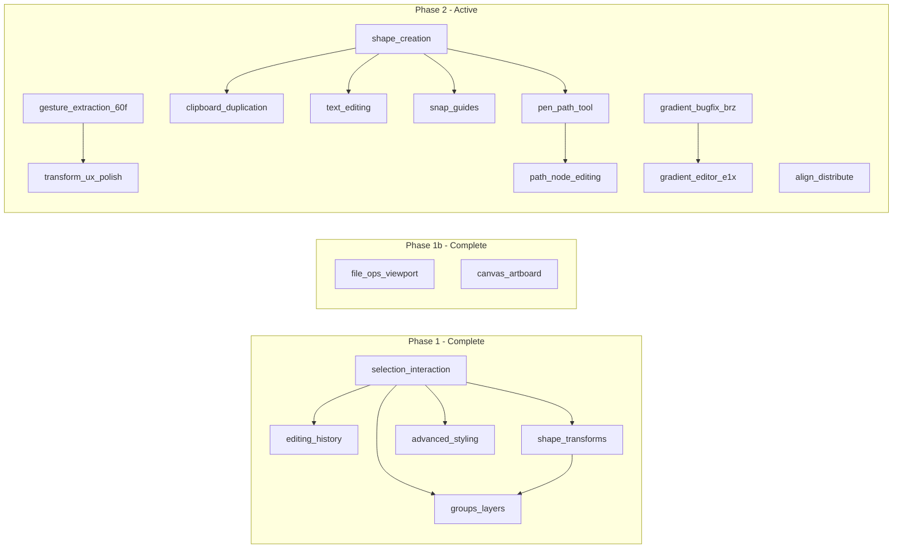

# Product roadmap

Single source of truth for **epic order**, **dependencies**, and **links** to bd-mapped epic plans. Original MVP capabilities (load, preview, select, fill/stroke, export) are documented in [PROJECT_SUMMARY.md](./PROJECT_SUMMARY.md).

## Completed epics (phase 1)

| Order | Epic | Slug | bd status | Progress |
|------:|------|------|-----------|----------|
| 1 | Multi-select and keyboard shortcuts | [selection-interaction](./epics/selection-interaction.md) | `CLOSED` | 8/8 (100%) |
| 2 | Undo and redo | [editing-history](./epics/editing-history.md) | `CLOSED` | 5/5 (100%) |
| 3 | Shape transforms (rotate, scale, skew) | [shape-transforms](./epics/shape-transforms.md) | `CLOSED` | 5/5 (100%) |
| 4 | Groups and layer management | [groups-layers](./epics/groups-layers.md) | `CLOSED` | 5/5 (100%) |
| 5 | Advanced stroke and fill | [advanced-styling](./epics/advanced-styling.md) | `CLOSED` | 5/5 (100%) |
| 9 | File operations and viewport UX | [file-ops-viewport](./epics/file-ops-viewport.md) | `CLOSED` | 5/5 (100%) |
| 7 | Shape creation tools | [shape-creation](./epics/shape-creation.md) | `CLOSED` | 6/6 (100%) |
| 14 | Canvas and artboard | [canvas-artboard](./epics/canvas-artboard.md) | `CLOSED` | 7/7 (100%) |

## Active epics (phase 2)

| Order | Epic | Slug | bd status | Progress | Depends on |
|------:|------|------|-----------|----------|------------|
| 6 | Transform and gesture UX polish | [transform-ux-polish](./epics/transform-ux-polish.md) | `OPEN` | 0/12 (0%) | Gesture extraction (`svg-editor-60f`) |
| 8 | Clipboard and duplication | [clipboard-duplication](./epics/clipboard-duplication.md) | `OPEN` | 0/7 (0%) | Shape creation helpful but not required |
| 10 | Text editing | [text-editing](./epics/text-editing.md) | `OPEN` | 0/7 (0%) | Shape creation (SC-1, SC-2a, SC-5) |
| 11 | Align and distribute | [align-distribute](./epics/align-distribute.md) | `OPEN` | 0/5 (0%) | Multi-select (done) |
| 12 | Snap and guides | [snap-guides](./epics/snap-guides.md) | `OPEN` | 0/8 (0%) | Shape creation (epic 7) helpful |
| 13 | Pen and path tool | [pen-path-tool](./epics/pen-path-tool.md) | `OPEN` | 7/7 (100%) | Shape creation (SC-1, shares tool infra); optional beads tfs.8–11 open in bd |
| 15 | Path node editing | [path-node-editing](./epics/path-node-editing.md) | `OPEN` | 4/5 (80%) | Pen tool (PP-2a segment model) |
| 16 | Advanced path editing | [advanced-path-editing](./epics/advanced-path-editing.md) | `OPEN` | 0/5 (0%) | Path node editing (`svg-editor-cfc`), pen/path foundation (`svg-editor-tfs`) |

## Free-standing issues

These beads are not part of an epic and can be tackled independently.

| bd ID | Title | Priority | Notes |
|-------|-------|----------|-------|
| `svg-editor-60f` | Extract gesture handlers from svg-canvas | P2 | Refactoring prerequisite for epic 6 |
| `svg-editor-ag5` | Undo delete should restore selection | P2 | Small UX fix |
| `svg-editor-brz` | Bug: normalizeColorForPicker destroys gradient fills | P2 | Bug fix |
| `svg-editor-e1x` | Full gradient editor UI | P3 | Depends on `svg-editor-brz` fix |
| `svg-editor-cno` | Bug: dragging Tree group hides child layer elements after drop | P2 | Drag/drop visibility bug with nested groups |
| `svg-editor-0lx` | Investigate group/ungroup behavior with pre-existing groups | P2 | Edge-case exploration for nested group operations |
| `svg-editor-5el` | Bug: artboard boundary stroke scales with zoom despite vector-effect | P2 | `vector-effect: non-scaling-stroke` ineffective under `preserveAspectRatio="none"` |
| `svg-editor-j1a` | Enhancement: artboard resize anchor point selector (9-point) | P3 | Choose which corner/edge/center stays fixed when resizing |

## Post-MVP

| bd ID | Title | Priority | Notes |
|-------|-------|----------|-------|
| — | Raster export (PNG/JPEG) | P4 | Export canvas as PNG with resolution/scale selector |
| — | Preview mode (artboard clipping) | P4 | Clip/dim content outside artboard boundary |
| — | Configurable keyboard shortcuts | P4 | User-editable shortcut bindings |
| — | Align to artboard/canvas | P4 | Align shapes relative to document bounds (vs. selection bounds) |

## Dependency graph

## Recommended execution order

1. **Now (free-standing):** `svg-editor-brz` (bug), `svg-editor-ag5` (UX fix), `svg-editor-60f` (refactoring)
2. ~~**Epic 7** (shape creation)~~ -- **DONE**
3. **Epic 13** (pen / path tool) -- creation companion; enables freeform drawing
4. **Epic 8** (clipboard / duplication) -- standard editor expectation, high value once shapes can be created
5. **Epic 11** (align / distribute) -- high value with multi-select already in place
6. **Epic 12** (snap / guides) -- improves creation and positioning precision
7. **Epic 6** (transform UX polish) -- includes skew, z-order UI, modifier keys
8. **Epic 10** (text editing) -- inline text editing and font controls
9. **Epic 15** (path node editing) -- fine-grained path manipulation
10. **`svg-editor-e1x`** (gradient editor) -- after `svg-editor-brz` fix lands

## Beads epic references

Epic issues in `bd` (see `bd list -t epic` or `bd show <id>` if this table drifts).
Status/progress below is current as of 2026-04-21.

| Slug | bd epic ID | Title | Status | Progress |
|------|------------|--------|--------|----------|
| selection-interaction | `svg-editor-3b7` | Multi-select and keyboard shortcuts | `CLOSED` | 8/8 |
| editing-history | `svg-editor-bbc` | Undo and redo | `CLOSED` | 5/5 |
| shape-transforms | `svg-editor-2zo` | Shape transforms | `CLOSED` | 5/5 |
| groups-layers | `svg-editor-0l4` | Groups and layer management | `CLOSED` | 5/5 |
| advanced-styling | `svg-editor-v77` | Advanced stroke and fill | `CLOSED` | 5/5 |
| transform-ux-polish | `svg-editor-vfr` | Transform and gesture UX polish | `OPEN` | 0/12 |
| shape-creation | `svg-editor-og7` | Shape creation tools | `CLOSED` | 6/6 |
| clipboard-duplication | `svg-editor-d79` | Clipboard and duplication | `OPEN` | 0/7 |
| file-ops-viewport | `svg-editor-we7` | File operations and viewport UX | `CLOSED` | 5/5 |
| text-editing | `svg-editor-nkz` | Text editing | `OPEN` | 0/7 |
| align-distribute | TBD | Align and distribute | `OPEN` | 0/5 |
| snap-guides | TBD | Snap and guides | `OPEN` | 0/8 |
| pen-path-tool | `svg-editor-tfs` | Pen and path tool | `OPEN` | 7/7 |
| canvas-artboard | `svg-editor-dl9` | Canvas and artboard | `CLOSED` | 7/7 |
| path-node-editing | `svg-editor-cfc` | Path node editing | `OPEN` | 4/5 |
| advanced-path-editing | `svg-editor-4nz` | Advanced path editing | `OPEN` | 0/5 |

## How to use this roadmap

1. Approve or adjust epic order and dependencies above.
2. Open the linked epic plan under `plans/epics/` for implementation detail and **`bd create` mappings**.
3. Track work with `bd ready`, `bd epic status`, and parent/child links as described in [AGENTS.md](../AGENTS.md).
