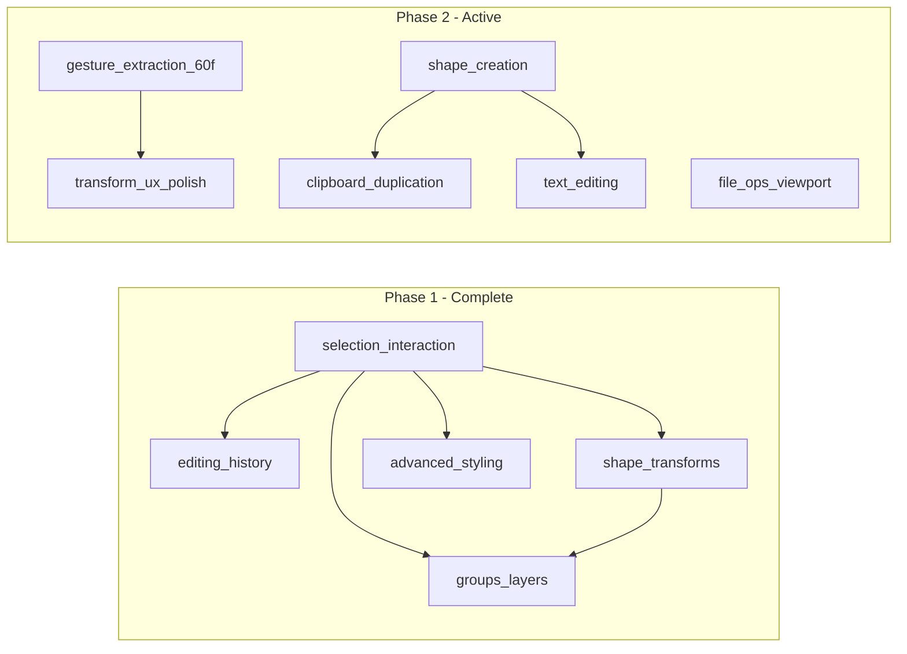

# Product roadmap

Single source of truth for **epic order**, **dependencies**, and **links** to bd-mapped epic plans. Original MVP capabilities (load, preview, select, fill/stroke, export) are documented in [PROJECT_SUMMARY.md](./PROJECT_SUMMARY.md).

## Completed epics (phase 1)

| Order | Epic | Slug | bd status | Progress |
|------:|------|------|-----------|----------|
| 1 | Multi-select and keyboard shortcuts | [selection-interaction](./epics/selection-interaction.md) | `CLOSED` | 8/8 (100%) |
| 2 | Undo and redo | [editing-history](./epics/editing-history.md) | `CLOSED` | 5/5 (100%) |
| 3 | Shape transforms (rotate, scale, skew) | [shape-transforms](./epics/shape-transforms.md) | `CLOSED` | 5/5 (100%) |
| 4 | Groups and layer management | [groups-layers](./epics/groups-layers.md) | `CLOSED` | 5/5 (100%) |
| 5 | Advanced stroke and fill | [advanced-styling](./epics/advanced-styling.md) | `CLOSED` | 5/5 (100%) |

## Active epics (phase 2)

| Order | Epic | Slug | bd status | Progress | Depends on |
|------:|------|------|-----------|----------|------------|
| 6 | Transform and gesture UX polish | [transform-ux-polish](./epics/transform-ux-polish.md) | `OPEN` | 0/7 (0%) | Gesture extraction (`svg-editor-60f`) |
| 7 | Shape creation tools | [shape-creation](./epics/shape-creation.md) | `OPEN` | 0/6 (0%) | — |
| 8 | Clipboard and duplication | [clipboard-duplication](./epics/clipboard-duplication.md) | `OPEN` | 0/5 (0%) | Shape creation helpful but not required |
| 9 | File operations and viewport UX | [file-ops-viewport](./epics/file-ops-viewport.md) | `OPEN` | 0/5 (0%) | — |
| 10 | Text editing | [text-editing](./epics/text-editing.md) | `OPEN` | 0/5 (0%) | Shape creation (shares tool infrastructure) |

## Free-standing issues

These beads are not part of an epic and can be tackled independently.

| bd ID | Title | Priority | Notes |
|-------|-------|----------|-------|
| `svg-editor-60f` | Extract gesture handlers from svg-canvas | P2 | Refactoring prerequisite for epic 6 |
| `svg-editor-ag5` | Undo delete should restore selection | P2 | Small UX fix |
| `svg-editor-brz` | Bug: normalizeColorForPicker destroys gradient fills | P2 | Bug fix |

## Deferred / post-MVP issues

| bd ID | Title | Priority | Notes |
|-------|-------|----------|-------|
| `svg-editor-w1t` | Skew transform support | P4 | Deferred from epic 3 |
| `svg-editor-e1x` | Full gradient editor UI (phase 2) | P3 | Depends on `svg-editor-brz` fix |

## Dependency graph

## Recommended execution order

1. **Now (free-standing):** `svg-editor-brz` (bug), `svg-editor-ag5` (UX fix), `svg-editor-60f` (refactoring)
2. **Epic 9** (file ops / viewport) -- FO-1 (download button) is near-trivial and immediately useful
3. **Epic 7** (shape creation) -- the largest gap; transforms the editor from modifier to creator
4. **Epic 8** (clipboard) -- standard editor expectation, high value once shapes can be created
5. **Epic 6** (transform UX polish) -- nice-to-have polish, can be interleaved
6. **Epic 10** (text editing) -- post-MVP stretch goal

## Beads epic references

Epic issues in `bd` (see `bd list -t epic` or `bd show <id>` if this table drifts).
Status/progress below is current as of 2026-04-19.

| Slug | bd epic ID | Title | Status | Progress |
|------|------------|--------|--------|----------|
| selection-interaction | `svg-editor-3b7` | Multi-select and keyboard shortcuts | `CLOSED` | 8/8 |
| editing-history | `svg-editor-bbc` | Undo and redo | `CLOSED` | 5/5 |
| shape-transforms | `svg-editor-2zo` | Shape transforms | `CLOSED` | 5/5 |
| groups-layers | `svg-editor-0l4` | Groups and layer management | `CLOSED` | 5/5 |
| advanced-styling | `svg-editor-v77` | Advanced stroke and fill | `CLOSED` | 5/5 |
| transform-ux-polish | `svg-editor-vfr` | Transform and gesture UX polish | `OPEN` | 0/7 |
| shape-creation | `svg-editor-og7` | Shape creation tools | `OPEN` | 0/6 |
| clipboard-duplication | `svg-editor-d79` | Clipboard and duplication | `OPEN` | 0/5 |
| file-ops-viewport | `svg-editor-we7` | File operations and viewport UX | `OPEN` | 0/5 |
| text-editing | `svg-editor-nkz` | Text editing | `OPEN` | 0/5 |

## How to use this roadmap

1. Approve or adjust epic order and dependencies above.
2. Open the linked epic plan under `plans/epics/` for implementation detail and **`bd create` mappings**.
3. Track work with `bd ready`, `bd epic status`, and parent/child links as described in [AGENTS.md](../AGENTS.md).
