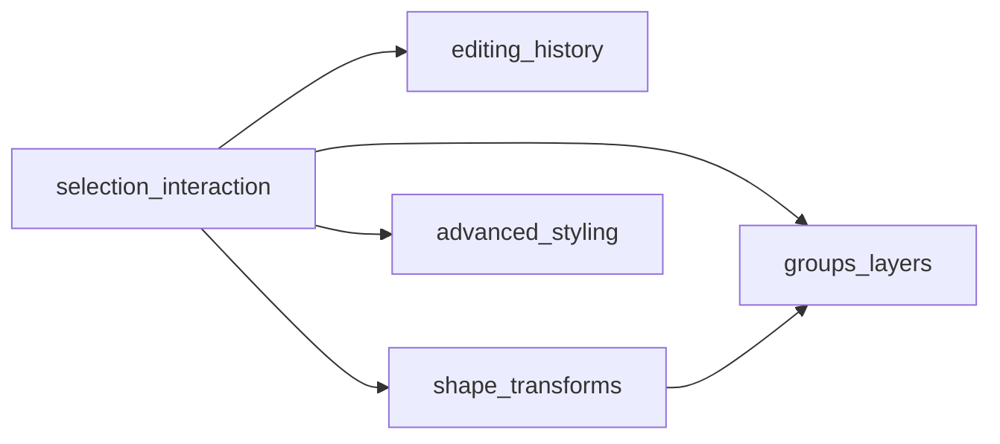

# Product roadmap (post-MVP)

Single source of truth for **epic order**, **dependencies**, and **links** to bd-mapped epic plans. MVP capabilities (load, preview, select, fill/stroke, export) are documented in [PROJECT_SUMMARY.md](./PROJECT_SUMMARY.md).

## Epic order

| Order | Epic | Slug | Depends on |
|------:|------|------|------------|
| 1 | Multi-select and keyboard shortcuts | [selection-interaction](./epics/selection-interaction.md) | — |
| 2 | Undo and redo | [editing-history](./epics/editing-history.md) | Selection model stable (epic 1 in progress or done) |
| 3 | Shape transforms (rotate, scale, skew) | [shape-transforms](./epics/shape-transforms.md) | Multi-select useful but not strictly required; depends on selection APIs |
| 4 | Groups and layer management | [groups-layers](./epics/groups-layers.md) | Selection; transforms help with group bounds |
| 5 | Advanced stroke and fill | [advanced-styling](./epics/advanced-styling.md) | Core manipulation patterns from earlier epics |

## Beads epic references

Epic issues in `bd` (see `bd list -t epic` or `bd show <id>` if this table drifts).

| Slug | bd epic ID | Title |
|------|------------|--------|
| selection-interaction | `svg-editor-3b7` | Multi-select and keyboard shortcuts |
| editing-history | `svg-editor-bbc` | Undo and redo |
| shape-transforms | `svg-editor-2zo` | Shape transforms |
| groups-layers | `svg-editor-0l4` | Groups and layer management |
| advanced-styling | `svg-editor-v77` | Advanced stroke and fill |

## How to use this roadmap

1. Approve or adjust epic order and dependencies above.
2. Open the linked epic plan under `plans/epics/` for implementation detail and **`bd create` mappings**.
3. Track work with `bd ready`, `bd epic status`, and parent/child links as described in [AGENTS.md](../AGENTS.md).
