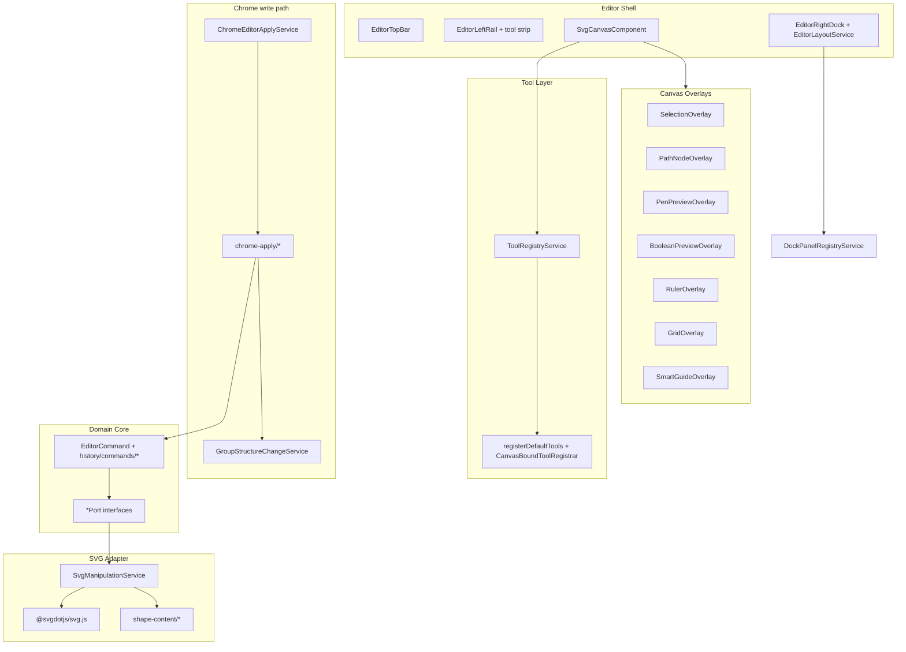

# Epic: Hexagonal architecture — tool plugin system & UI composition

| Phase | Beads epic | Status |
|-------|------------|--------|
| **1** | [`svg-editor-j61`](../../) | Closed 2026-06-23 |
| **2** | [`svg-editor-hnv`](../../) | Closed 2026-06-23 (18/18 children) |
| **3** | [`svg-editor-ywh`](../../) | Closed 2026-06-23 (7/7 children) |

**Handoff docs:** [ARCHITECTURE.md](../ARCHITECTURE.md) (current seams + gravity wells) · [CONTEXT.md](../../CONTEXT.md) (editor vocabulary)

## Post-close architecture debt

Phases 1–3 closed the planned epic work, but **runtime gaps remain** — line counts, routing locations, and registry completeness in this file were stale as of 2026-07-10.

**Track ongoing debt:** [ARCHITECTURE-DEBT.md](../ARCHITECTURE-DEBT.md) (adversarial review) · beads epic [`svg-editor-my0`](../../) — architecture debt register (DEBT-001–012).

High-signal items not finished by phase close: debug HUD + context wiring on the canvas adapter (~2,093 lines TS + 232 HTML after DEBT-003/011/012). Coordinate mapping wired (`svg-editor-my0.2` ✓); input policy in named modules (`svg-canvas-click.controller.ts`, `svg-canvas-keyboard-policy.ts`, `pen-insert-hover-cursor.ts`); preview overlays extracted (`svg-editor-my0.11`, `svg-editor-bd1` ✓). See the debt register — do not reopen j61 / hnv / ywh epics for these.

## Goal

Improve editor extensibility toward hexagonal architecture: (1) a **tool plugin seam** so new canvas tools register without deep canvas edits, and (2) a **UI composition layer** for rapid layout/panel/visual iteration.

## Does it follow hexagonal architecture?

**Modular monolith with typed seams** — j61/hnv/ywh improved extensibility at boundaries; runtime is still Angular singletons and a large canvas adapter, not isolated ports/adapters in the hexagonal sense. Prefer that wording over “partially hexagonal” (see DEBT-004 in [ARCHITECTURE-DEBT.md](../ARCHITECTURE-DEBT.md)).

### Existing strengths

- **Ports** — `PenToolSessionPorts`, `LayersPanelSvgPort`, `TransformGestureSvgPort`, `LayerLockReadPort`, `PathBooleanSelectionReadPort`, `GroupStructureChangePort`, etc.
- **`SvgManipulationService`** — façade implementing many ports over sub-services (`shape-content/*`, layer structure, gradient defs, …).
- **`EditorCommand` / `EditorHistoryService`** — intent vs execution; undoable mutations; implementations split under `history/commands/{paint,transform,layers,document,path}/`.
- **`PenToolSession` + ports** — testable without the full canvas.
- **`ToolRegistryService` + `CanvasTool`** — `ToolDescriptor` metadata registers at app startup; `CanvasTool` adapters bind later via `CanvasBoundToolRegistrar` when the canvas pointer stack exists. Pointer down/move/up and selector click/double-click go through adapters; cross-cutting policy in `svg-canvas-click.controller.ts`, `svg-canvas-keyboard-policy.ts`, and `pen-insert-hover-cursor.ts` (DEBT-001 ✓).
- **Thin chrome apply façade** — `ChromeEditorApplyService` delegates to `chrome-apply/*` domain slices; group-structure notifications use `GroupStructureChangeService` (no canvas callback on chrome apply).

### Remaining gaps (post–phase 3)

| Problem | Where | Notes |
|---|---|---|
| **Large canvas adapter** | `SvgCanvasComponent` (~2,093 lines TS + 232 HTML) | Overlays + policy modules extracted; debug HUD + context wiring remain (DEBT-003 partial). |
| **Dual input routing** | Canvas click / keyboard / cursor | `PointerGestureRouter` clean (**65** lines); policy in `svg-canvas-click.controller.ts`, `svg-canvas-keyboard-policy.ts`, `pen-insert-hover-cursor.ts` (DEBT-001 ✓). |
| **Coordinate mapping** | `CanvasCoordinateMappingService` | Wired from canvas lifecycle (closed `svg-editor-my0.2` ✓); canvas delegates `clientToEditorSvgPoint`. |
| **Deferred canvas tool binding** | `CanvasBoundToolRegistrar` | Descriptors at startup; creation/pen/selector/view-utility adapters register when canvas initializes — not a single `registerDefaultTools()` moment (DEBT-005). |
| **Angular in domain** | Most services | `@Injectable({ providedIn: 'root' })` — acceptable for this app; not pure hexagonal isolation. |
| **`SvgManipulationService` breadth** | Central façade | Narrow ports at panel boundaries (properties, boolean path, layers DnD); façade still wide for history commands. |

**Resolved in phase 2 (no longer gaps):**

| Was | Now |
|-----|-----|
| `ChromeEditorApplyService` mega-facade (~950 lines) | `chrome-apply/{paint,transform,layers,path-ops}` + support + `GroupStructureChangeService` |
| `editor-command-implementations.ts` monolith | `history/commands/*` by domain + barrel re-export |
| `svg-shape-content.service.ts` monolith | `shape-content/{paint,path-data,text}` + thin façade |
| Rulers / grid / smart guides in canvas template | `overlays/{ruler,grid,smart-guide}-overlay.component.*` |
| `afterGroupStructureChange` imperative callback | `GroupStructureChangeService` signal port |
| Layers panel DnD inline (~200 lines) | `LayersPanelDndService` |
| Duplicate path boolean DOM reads | `PathBooleanSelectionReadService` shared by panel + geometry |
| Unregistered selector / pen / zoom / pan / text / eyedropper | `CanvasTool` adapters + `registerDefaultTools()` / `CanvasBoundToolRegistrar` in `app.config.ts` |
| Dock auto-show / shell layout ad hoc | `DockPanelAutoShowService`, `EditorLayoutService` |
| Hardcoded tool strip buttons | `ToolDescriptor` + `registerDefaultToolDescriptors()` + registry-driven strip |

---

## Phase 1 — `svg-editor-j61` (closed)

### Track 1 — Tool plugin system (j61.1–j61.3)

| Bead | Deliverable |
|------|-------------|
| j61.1 | [`CanvasTool`](../../src/app/tools/canvas-tool.interface.ts), [`CanvasToolHost`](../../src/app/tools/canvas-tool-host.interface.ts) |
| j61.2 | [`ToolRegistryService`](../../src/app/tools/tool-registry.service.ts); pointer dispatch in [`PointerGestureRouter`](../../src/app/components/svg-canvas/gestures/pointer-gesture-router.ts); click/dblclick via registry adapters on canvas |
| j61.3 | [`creation-canvas-tool.ts`](../../src/app/tools/creation-canvas-tool.ts) — `rect` / `ellipse` / `line` adapters |

### Track 2 — UI composition (j61.4–j61.6)

| Bead | Deliverable |
|------|-------------|
| j61.4 | [`src/styles/tokens.scss`](../../src/styles/tokens.scss) — `--editor-*` design tokens |
| j61.5 | [`DockPanelRegistryService`](../../src/app/panels/dock-panel-registry.service.ts), [`registerDefaultDockPanels()`](../../src/app/panels/register-default-dock-panels.ts) |
| j61.6 | [`SelectionOverlayComponent`](../../src/app/components/svg-canvas/overlays/selection-overlay.component.ts), [`PathNodeOverlayComponent`](../../src/app/components/svg-canvas/overlays/path-node-overlay.component.ts) |

---

## Phase 2 — `svg-editor-hnv` (deepen seams)

**Epic:** `svg-editor-hnv` · **Plan source:** architecture improvement review (handoff `improve-codebase-architecture` 2026-05-22)

### Children (bead status)

| Bead | ARCH | Summary | Status |
|------|------|---------|--------|
| hnv.1 | ARCH-7 | Tool registry foundation — creation routing | ✓ |
| hnv.2 | ARCH-8 | `registerDefaultTools()` in `app.config.ts` | ✓ |
| hnv.3 | ARCH-9 | `ToolRegistry` `onKeyDown` in keyboard controller | ✓ |
| hnv.4 | ARCH-10 | `ToolDescriptor` metadata + registry-driven tool strip | ✓ |
| hnv.5 | ARCH-11 | `PenToolSession` as `CanvasTool` adapter | ✓ |
| hnv.6 | ARCH-12 | Selector as `CanvasTool` adapter | ✓ |
| hnv.7 | ARCH-13 | `DockPanelDescriptor.relevantTools` auto-show | ✓ |
| hnv.8 | ARCH-14 | `EditorLayoutService` shell layout signals | ✓ |
| hnv.9 | ARCH-15 | Split `editor-command-implementations` by domain | ✓ |
| hnv.10 | ARCH-16 | Split `svg-shape-content` by domain | ✓ |
| hnv.11 | ARCH-20 | Split `ChromeEditorApplyService` + `GroupStructureChangePort` | ✓ |
| hnv.12 | ARCH-21 | Ruler / grid / smart-guide overlay components | ✓ |
| hnv.13 | ARCH-19 | Narrow ports at properties + boolean path panels | ✓ |
| hnv.14 | ARCH-17 | `LayersPanelDndService` | ✓ |
| hnv.15 | ARCH-22 | `PathBooleanSelectionReadPort` shared read model | ✓ |
| hnv.16 | ARCH-23 | Tool classification in registry metadata | ✓ |
| hnv.17 | ARCH-24 | Remaining tools as `CanvasTool` (zoom, pan, text, eyedropper, …) | ✓ |
| hnv.18 | ARCH-25 | Update architecture docs (this file + ARCHITECTURE.md) | ✓ |

### Phase 2 deliverables (by area)

**Tools**

- [`register-default-tools.ts`](../../src/app/tools/register-default-tools.ts) — app startup: `ToolDescriptor` registration + attach `CanvasBoundToolRegistrar`; canvas-bound `CanvasTool` adapters register when the canvas adapter initializes.
- Adapters: creation, selector, pen, zoom, pan, text, eyedropper (+ node-edit where applicable).

**Commands & content**

- [`history/commands/`](../../src/app/history/commands/) — paint, transform, layers, document, path command implementations.
- [`shape-content/`](../../src/app/services/shape-content/) — paint, path-data, text slices behind `SvgShapeContentService` façade.

**Chrome apply**

- [`chrome-apply/`](../../src/app/services/chrome-apply/) — paint / transform / layers / path-ops apply services.
- [`GroupStructureChangeService`](../../src/app/services/chrome-apply/group-structure-change.service.ts) — canvas drill-in sync via signal (replaces `afterGroupStructureChange`).

**UI composition**

- [`EditorLayoutService`](../../src/app/services/editor-layout.service.ts) — dock tab, collapse, rail/dock width signals.
- [`DockPanelAutoShowService`](../../src/app/panels/dock-panel-auto-show.service.ts) — `relevantTools` panel suggestions.
- Overlays: ruler, grid, smart-guide child components under `svg-canvas/overlays/`.
- [`LayersPanelDndService`](../../src/app/components/layers-panel/layers-panel-dnd.service.ts) — layer drag-and-drop intent + apply.

**Typed ports (panel boundaries)**

- [`LayerLockReadPort`](../../src/app/history/layer-lock-read.port.ts) — properties panel lock readout.
- [`PathBooleanSelectionReadPort`](../../src/app/history/path-boolean-selection-read.port.ts) — path ops panel + `PathBooleanGeometryService`.

---

## Target architecture (current)

---

## Recommended next steps

Phase 3 (`svg-editor-ywh`) is closed. Follow [ARCHITECTURE-DEBT.md](../ARCHITECTURE-DEBT.md) for remaining items (`svg-editor-my0` epic):

1. ✓ `CanvasCoordinateMappingService` wired (`svg-editor-my0.2` / DEBT-002).
2. ✓ Shrink canvas hub — session coordinator, pen preview overlay (DEBT-003, DEBT-011), boolean preview overlay (DEBT-012).
3. ✓ Input policy modules — click, keyboard, pen-insert cursor (`svg-editor-1sb` / DEBT-001).
4. **Open (optional):** debug HUD + context wiring shrink (DEBT-003 partial).
5. Optional: `InjectionToken` per port; drive tool context bar from `ToolDescriptor.contextBarComponent`.

---

## Phase 3 — `svg-editor-ywh` (dedup & unify)

**Epic:** `svg-editor-ywh` · **Plan source:** post–Phase 2 architecture review (2026-06-23)

Phase 2 introduced `CanvasTool` adapters but kept parallel **legacy** paths in `PointerGestureRouter` for tests, scattered tool metadata across 4+ files, and duplicate keyboard/HUD routing. Phase 3 removed router legacy paths (ywh.5) and unified tool bundles — **post-close**, input policy modules and preview overlays are closed; optional debug HUD shrink remains — see [ARCHITECTURE-DEBT.md](../ARCHITECTURE-DEBT.md).

### Children (bead status)

| Bead | ARCH | Summary | Depends on | Priority |
|------|------|---------|------------|----------|
| ywh.1 | ARCH-26 | Shared test helper registers full default `CanvasTool` set | — | P2 | ✓ |
| ywh.2 | ARCH-28 | Remove dead pen Enter/Backspace keyboard fallbacks | — | P2 | ✓ |
| ywh.3 | ARCH-29 | Fix `CanvasSvgPoint` mapping on pointer move/up | — | P2 | ✓ |
| ywh.4 | ARCH-30 | Unified tool bundle (descriptor + adapter + shortcut) | — | P2 | ✓ |
| ywh.5 | ARCH-27 | Remove `PointerGestureRouter` legacy routing paths | ywh.1 | P2 | ✓ |
| ywh.6 | ARCH-31 | Pointer-intent debug HUD uses registry routing | ywh.5 | P3 | ✓ |
| ywh.7 | ARCH-32 | Consolidate canvas host context interfaces | — | P4 | ✓ |

### Suggested grab order

1. **ywh.1** (test helper) — unblocks legacy router removal  
2. **ywh.2**, **ywh.3**, **ywh.4** — parallel quick wins  
3. **ywh.5** — removed legacy routing from `PointerGestureRouter` (**65** lines remain); click/keyboard/cursor policy now in named modules (DEBT-001 ✓)  
4. **ywh.6** — trim debug HUD third copy  
5. **ywh.7** — optional host-interface consolidation  

### Out of scope (defer)

- ~~Pen preview / boolean preview extraction from `SvgCanvasComponent`~~ — done (`PenPreviewOverlayComponent`, `BooleanPreviewOverlayComponent`; DEBT-011/012)
- Removing `SvgShapeContentService` / `ChromeEditorApplyService` façade pass-throughs (stable panel APIs)
- `InjectionToken` per port

---

## Commits reference

**Phase 1 (j61, 2026-06):** `736e7fb`, `49c1b80`, `7c7adee`, `d448a5a`, `472ac2d`, `8afe5a0`

**Phase 2 (hnv, 2026-06):** see `git log --oneline --grep=hnv` on `master` — includes command/shape-content/chrome-apply splits, overlay extraction, `GroupStructureChangeService`, layers DnD, path boolean read port, typed panel ports.
