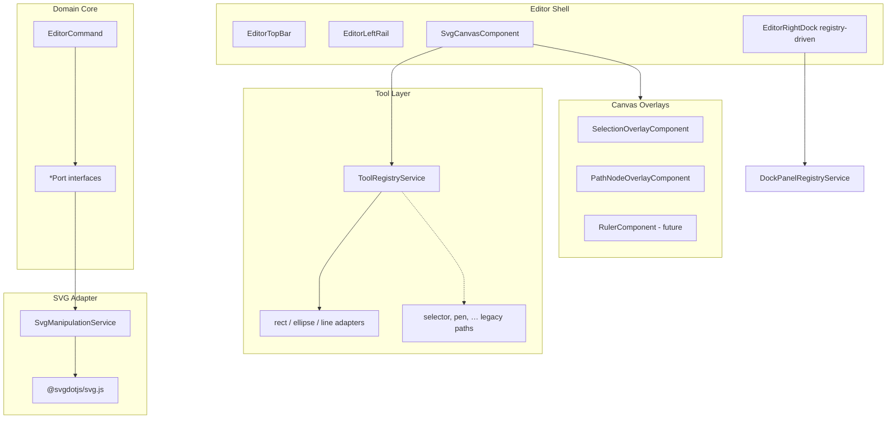

# Epic: Hexagonal architecture — tool plugin system & UI composition

**Beads epic:** `svg-editor-j61` (closed 2026-06-23)

## Goal

Improve editor extensibility toward hexagonal architecture: (1) a **tool plugin seam** so new canvas tools register without deep canvas edits, and (2) a **UI composition layer** for rapid layout/panel/visual iteration.

## Does it follow hexagonal architecture?

**Partially — the bones were there; j61 strengthened the seams.**

### Existing strengths (unchanged)

- **Ports** — `PenToolSessionPorts`, `LayersPanelSvgPort`, `TransformGestureSvgPort`, `ChromeEditorApplySvgPort`, etc.
- **`SvgManipulationService`** — façade implementing many ports over sub-services.
- **`EditorCommand` / `EditorHistoryService`** — intent vs execution; undoable mutations.
- **`PenToolSession` + ports** — testable without the full canvas.

### Remaining gaps

| Problem | Where |
|---|---|
| **Large canvas adapter** | `SvgCanvasComponent` is still ~4200 lines TS (template slimmed). Pen, selector, rulers, keyboard, inline text remain inline. |
| **Legacy tool routing** | `PointerGestureRouter` still has `if (tool === …)` fallbacks for unregistered tools (selector, pen, zoom, pan, etc.). |
| **Angular in domain** | Services remain `@Injectable({ providedIn: 'root' })`. |
| **`ChromeEditorApplyService` mega-facade** | Paint, stroke, align, layer ops, boolean ops in one service. |
| **Partial overlay extraction** | Grid, smart guides, rulers, pen previews still in canvas template. |

---

## Track 1 — Tool plugin system

### Implemented (j61.1–j61.3)

| Bead | Deliverable |
|------|-------------|
| j61.1 | [`CanvasTool`](../../src/app/tools/canvas-tool.interface.ts), [`CanvasToolHost`](../../src/app/tools/canvas-tool-host.interface.ts) |
| j61.2 | [`ToolRegistryService`](../../src/app/tools/tool-registry.service.ts); dispatch in [`PointerGestureRouter`](../../src/app/components/svg-canvas/gestures/pointer-gesture-router.ts) and `SvgCanvasComponent.onCanvasClick`; activate/deactivate on tool switch |
| j61.3 | [`creation-canvas-tool.ts`](../../src/app/tools/creation-canvas-tool.ts) — `rect` / `ellipse` / `line` wrapped as `CanvasTool` adapters over `CreationGesture` |

**Pattern:** registry lookup runs first; registered handler returning `true` consumes the event; legacy gesture paths remain as fallback until each tool is migrated.

```typescript
// src/app/tools/canvas-tool.interface.ts (summary)
export interface CanvasTool {
  readonly toolId: EditorTool;
  onActivate(host: CanvasToolHost): void;
  onDeactivate(): void;
  onPointerDown?(event: MouseEvent, svgPoint: CanvasSvgPoint): boolean;
  onPointerMove?(event: MouseEvent, svgPoint: CanvasSvgPoint): void;
  onPointerUp?(event: MouseEvent, svgPoint: CanvasSvgPoint): void;
  onClick?(event: MouseEvent, svgPoint: CanvasSvgPoint): boolean;
  onKeyDown?(event: KeyboardEvent): boolean;
}
```

### Not yet done

- Wrap `selector`, `pen`, `zoom`, `pan`, `text`, `eyedropper` as `CanvasTool` adapters.
- Drive tool strip from registry metadata.
- Optional `onKeyDown` dispatch in keyboard controller.

---

## Track 2 — UI composition layer

### Implemented (j61.4–j61.6)

| Bead | Deliverable |
|------|-------------|
| j61.4 | [`src/styles/tokens.scss`](../../src/styles/tokens.scss) — `--editor-*` design tokens; shell components migrated |
| j61.5 | [`DockPanelRegistryService`](../../src/app/panels/dock-panel-registry.service.ts), [`registerDefaultDockPanels()`](../../src/app/panels/register-default-dock-panels.ts); [`EditorRightDockComponent`](../../src/app/components/editor-right-dock/) registry-driven via `NgComponentOutlet` |
| j61.6 | [`SelectionOverlayComponent`](../../src/app/components/svg-canvas/overlays/selection-overlay.component.ts), [`PathNodeOverlayComponent`](../../src/app/components/svg-canvas/overlays/path-node-overlay.component.ts) — canvas template ~676 → ~403 lines |

`EditorDockPanel` is now `string` (panel id from registry).

### Not yet done

- `EditorLayoutService` (panel widths, collapse, layout modes as signals).
- Extract `RulerComponent`, grid/smart-guide overlays from canvas.
- Split `ChromeEditorApplyService` into focused per-domain adapters.

---

## Target architecture



---

## Recommended follow-up sequence

1. Wrap `selector` and `pen` as `CanvasTool` adapters (highest traffic tools).
2. `EditorLayoutService` for shell layout iteration.
3. Extract ruler + grid/guide overlays.
4. Split `ChromeEditorApplyService` by domain (fill, transform, layers).

## Commits (master, 2026-06)

- `736e7fb` — CanvasTool + CanvasToolHost interfaces
- `49c1b80` — ToolRegistryService + dispatch wiring
- `7c7adee` — Creation tool adapters
- `d448a5a` — Design tokens
- `472ac2d` — Dock panel registry
- `8afe5a0` — Selection + path-node overlay components
